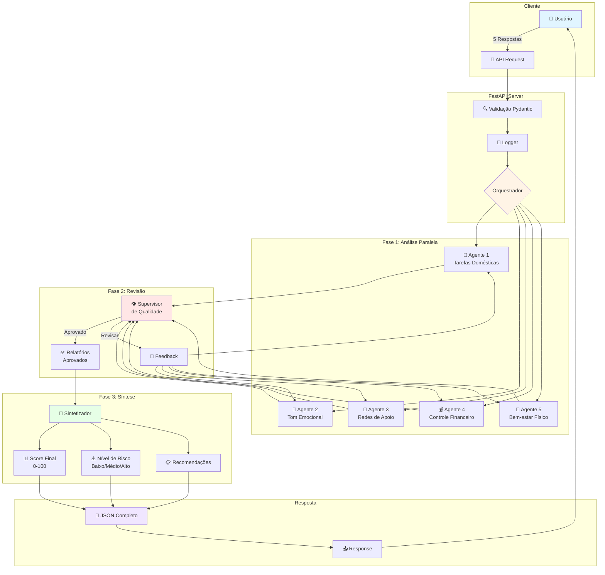
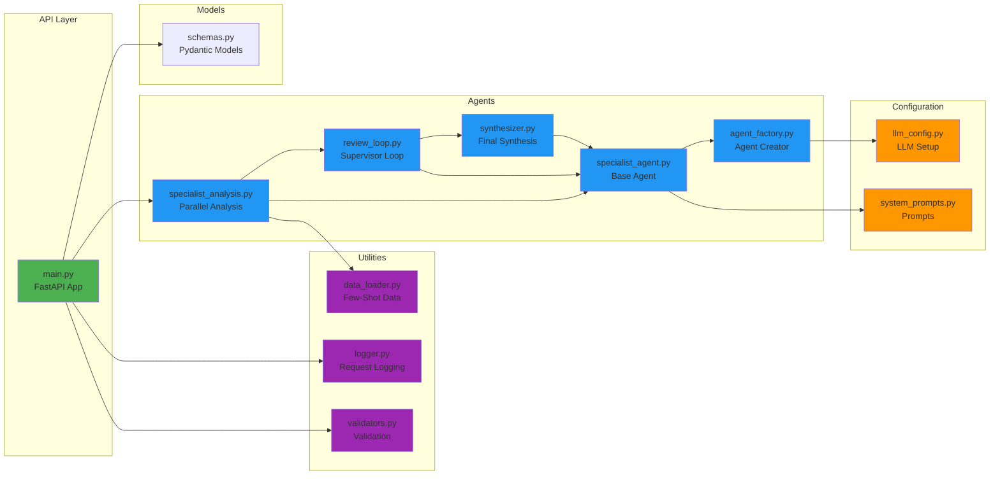
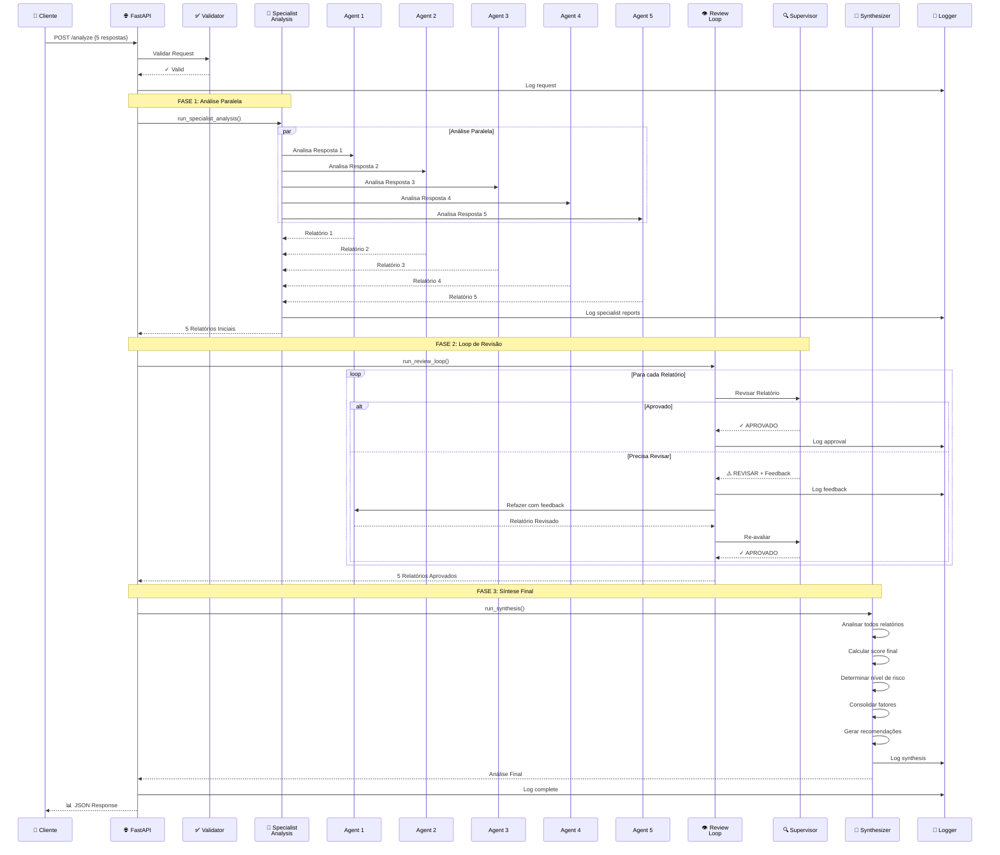
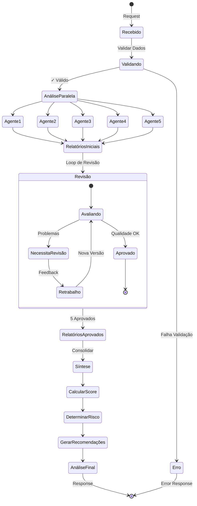
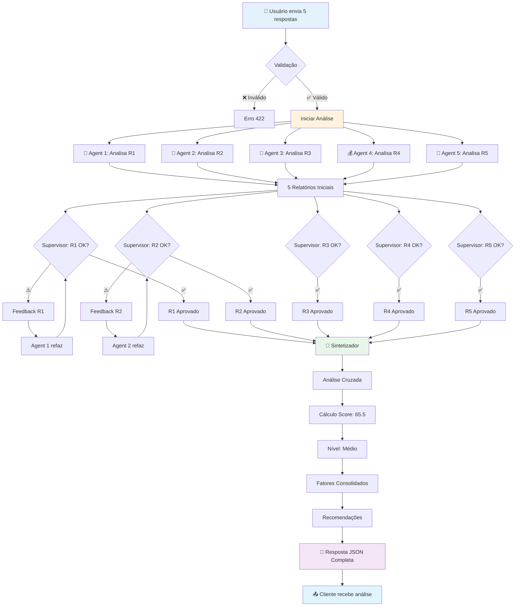

# 🤖 HubAgents V2 - Sistema Multi-Agente de Análise de Risco

[](https://www.python.org/downloads/)
[](https://fastapi.tiangolo.com/)
[](https://microsoft.github.io/agent-framework/)
[](LICENSE)

Sistema avançado de análise de risco utilizando **múltiplos agentes de IA** baseado no **Microsoft Agent Framework**. O sistema analisa respostas de usuários através de 5 agentes especialistas, um supervisor de qualidade e um sintetizador para produzir análises de risco detalhadas e fundamentadas.

---

## 📋 Índice

- [Visão Geral](#-visão-geral)
- [Arquitetura do Sistema](#-arquitetura-do-sistema)
- [Fluxo de Execução](#-fluxo-de-execução)
- [Componentes Principais](#-componentes-principais)
- [Instalação](#-instalação)
- [Configuração](#-configuração)
- [Uso da API](#-uso-da-api)
- [Estrutura do Projeto](#-estrutura-do-projeto)
- [Tecnologias](#-tecnologias)
- [Exemplos](#-exemplos)

---

## 🎯 Visão Geral

O **HubAgents V2** é um sistema de análise de risco que utiliza inteligência artificial multi-agente para avaliar situações complexas através da análise de 5 respostas de usuários. Cada resposta é analisada por um agente especialista em seu domínio específico, passando por um processo de revisão de qualidade antes de ser sintetizada em um relatório final consolidado.

### ✨ Principais Características

- 🧠 **5 Agentes Especialistas** - Cada um focado em um domínio específico
- 👁️ **Supervisor de Qualidade** - Revisa e aprova todas as análises
- 🔄 **Loop de Revisão** - Até 1 retrabalho por análise para garantir qualidade
- 📊 **Síntese Inteligente** - Consolida todas as avaliações em score unificado
- 🎯 **Análise Baseada em Few-Shot Learning** - Aprende com exemplos contextuais
- ⚡ **API REST Assíncrona** - Alta performance com FastAPI
- 🔌 **Multi-Provider LLM** - Suporta Azure OpenAI, OpenAI e Groq

### 🎭 Os 5 Agentes Especialistas

| Agente | Domínio | Foco da Análise |
|--------|---------|-----------------|
| **👔 Agente 1** | Tarefas Domésticas | Divisão de responsabilidades e dinâmicas de poder |
| **💬 Agente 2** | Tom Emocional | Comunicação, respeito e clima emocional |
| **🤝 Agente 3** | Redes de Apoio | Isolamento social e suporte disponível |
| **💰 Agente 4** | Controle Financeiro | Autonomia financeira e dependência econômica |
| **🏥 Agente 5** | Bem-estar Físico | Indicadores de agressão física e bem-estar |

---

## 🏗️ Arquitetura do Sistema

### Diagrama de Arquitetura Geral



### Diagrama de Componentes



---

## 🔄 Fluxo de Execução

### Fluxo Detalhado de Análise



### Estados do Sistema



---

## 🧩 Componentes Principais

### 1. API Layer (`main.py`)

FastAPI application que expõe o endpoint `/analyze` para receber requisições.

**Principais Responsabilidades:**
- Validação de entrada via Pydantic
- Orquestração do fluxo de análise
- Logging de requisições
- Documentação automática (Swagger/ReDoc)

### 2. Agents

#### `specialist_agent.py`
Classe base para todos os agentes especialistas.

```python
class SpecialistAgent:
    - Configuração de agente via Agent Framework
    - Execução de análise com prompt específico
    - Few-shot learning com exemplos do domínio
    - Estruturação de resposta em JSON
```

#### `specialist_analysis.py`
Executa análise paralela com os 5 agentes.

```python
async def run_specialist_analysis(responses, data_loader, logger):
    - Cria 5 agentes especializados
    - Executa análises em paralelo
    - Retorna 5 relatórios iniciais
```

#### `review_loop.py`
Implementa o loop de revisão com supervisor.

```python
async def run_review_loop(reports, responses, data_loader, logger):
    - Para cada relatório:
      - Supervisor avalia qualidade
      - Se REVISAR: agente refaz (máx 1 vez)
      - Se APROVADO: próximo
    - Retorna relatórios aprovados
```

#### `synthesizer.py`
Agente final que consolida todas as análises.

```python
async def run_synthesis(approved_reports, responses, logger):
    - Analisa todos os relatórios
    - Calcula score final (0-100)
    - Define risk_level
    - Gera recomendações
    - Retorna análise consolidada
```

### 3. Configuration

#### `llm_config.py`
Configuração multi-provider de LLM.

**Suporta:**
- Azure OpenAI (produção recomendada)
- OpenAI (alternativa)
- Groq (alta velocidade)

```python
def get_chat_client():
    # Tenta em ordem: Azure → OpenAI → Groq
    # Retorna cliente configurado
```

#### `system_prompts.py`
Prompts específicos para cada agente.

### 4. Models (`schemas.py`)

Modelos Pydantic para validação:

```python
- AnalysisRequest: Entrada (5 respostas)
- SpecialistReport: Relatório de especialista
- ReviewFeedback: Feedback do supervisor
- FinalAnalysis: Análise consolidada final
- RiskFactor: Fator de risco identificado
```

### 5. Utilities

- **`data_loader.py`**: Carrega exemplos few-shot dos CSVs
- **`logger.py`**: Sistema de logging em JSON
- **`validators.py`**: Validações customizadas

---

## 📦 Instalação

### Pré-requisitos

- Python 3.11 ou superior
- pip (gerenciador de pacotes Python)
- Conta em pelo menos um provedor de LLM (Azure OpenAI, OpenAI ou Groq)

### Passo a Passo

1. **Clone o repositório**
```bash
git clone https://github.com/cairocruz/hubAgentsV2.git
cd hubAgentsV2
```

2. **Crie um ambiente virtual**
```bash
python -m venv venv

# Windows
.\venv\Scripts\activate

# Linux/Mac
source venv/bin/activate
```

3. **Instale as dependências**
```bash
pip install --upgrade pip
pip install -r requirements.txt
```

4. **Configure as variáveis de ambiente**
```bash
# Copie o arquivo de exemplo
cp .env.example .env

# Edite o .env com suas credenciais
```

---

## ⚙️ Configuração

### Arquivo `.env`

Configure pelo menos um provedor de LLM:

#### Opção 1: Azure OpenAI (Recomendado)
```env
AZURE_OPENAI_ENDPOINT=https://your-resource.openai.azure.com
AZURE_OPENAI_API_KEY=your-api-key
AZURE_OPENAI_DEPLOYMENT_NAME=gpt-4o-mini
AZURE_OPENAI_API_VERSION=2024-02-01
```

#### Opção 2: OpenAI
```env
OPENAI_API_KEY=sk-...
OPENAI_MODEL=gpt-4o-mini
```

#### Opção 3: Groq (Alta Performance)
```env
GROQ_API_KEY=gsk_...
GROQ_MODEL=llama3-8b-8192
```

### Configurações Opcionais

```env
# Parâmetros do modelo
LLM_TEMPERATURE=0.2
LLM_MAX_TOKENS=4000

# Servidor
HOST=0.0.0.0
PORT=8000
```

---

## 🚀 Uso da API

### Iniciar o Servidor

```bash
# Windows
.\start_server.bat

# Ou manualmente
python main.py
```

O servidor estará disponível em: `http://localhost:8000`

### Documentação Interativa

- **Swagger UI**: http://localhost:8000/docs
- **ReDoc**: http://localhost:8000/redoc
- **OpenAPI Schema**: http://localhost:8000/openapi.json

### Endpoint Principal

#### `POST /analyze`

Analisa 5 respostas de usuário e retorna análise de risco completa.

**Request Body:**
```json
{
  "responses": [
    "Resposta sobre tarefas domésticas",
    "Resposta sobre tom emocional",
    "Resposta sobre redes de apoio",
    "Resposta sobre controle financeiro",
    "Resposta sobre bem-estar físico"
  ]
}
```

**Response:**
```json
{
  "final_score": 65.5,
  "risk_level": "Médio",
  "synthesis": "Análise consolidada de todos os relatórios...",
  "consolidated_factors": [
    {
      "factor": "Controle excessivo",
      "severity": "Alto",
      "description": "Descrição detalhada..."
    }
  ],
  "recommendations": [
    "Recomendação 1...",
    "Recomendação 2..."
  ],
  "specialist_reports": [
    {
      "agent_id": "agent_1",
      "domain": "Tarefas Domésticas",
      "analysis": "Análise detalhada...",
      "preliminary_score": 70.0,
      "risk_factors": [...],
      "justification": "Justificativa..."
    }
  ]
}
```

### Exemplo de Uso com cURL

```bash
curl -X POST "http://localhost:8000/analyze" \
  -H "Content-Type: application/json" \
  -d '{
    "responses": [
      "Sim, ele controla muito as tarefas de casa",
      "Às vezes ele me xinga durante discussões",
      "Não tenho amigos próximos",
      "Ele controla todo o dinheiro",
      "Tenho medo às vezes"
    ]
  }'
```

### Exemplo com Python

```python
import requests

url = "http://localhost:8000/analyze"
payload = {
    "responses": [
        "Sim, ele controla muito as tarefas de casa",
        "Às vezes ele me xinga durante discussões",
        "Não tenho amigos próximos",
        "Ele controla todo o dinheiro",
        "Tenho medo às vezes"
    ]
}

response = requests.post(url, json=payload)
result = response.json()

print(f"Score Final: {result['final_score']}")
print(f"Nível de Risco: {result['risk_level']}")
```

---

## 📁 Estrutura do Projeto

```
hubAgentsV2/
│
├── 📄 main.py                    # FastAPI application
├── 📄 requirements.txt           # Dependências Python
├── 📄 .env.example              # Template de configuração
├── 📄 README.md                 # Este arquivo
│
├── 📂 agents/                   # Agentes de IA
│   ├── specialist_agent.py     # Classe base do agente
│   ├── specialist_analysis.py  # Análise paralela
│   ├── review_loop.py          # Loop de revisão
│   ├── synthesizer.py          # Síntese final
│   └── agent_factory.py        # Factory de agentes
│
├── 📂 config/                   # Configurações
│   ├── llm_config.py           # Config de LLM
│   └── system_prompts.py       # Prompts dos agentes
│
├── 📂 models/                   # Modelos de dados
│   └── schemas.py              # Pydantic schemas
│
├── 📂 prompts/                  # Prompts do sistema
│   └── system_prompts.py       # Prompts especializados
│
├── 📂 utils/                    # Utilitários
│   ├── data_loader.py          # Carregador de exemplos
│   ├── logger.py               # Sistema de logging
│   └── validators.py           # Validadores
│
├── 📂 data/                     # Dados de treinamento
│   ├── dataset_1.csv           # Exemplos agente 1
│   ├── dataset_2.csv           # Exemplos agente 2
│   ├── dataset_3.csv           # Exemplos agente 3
│   ├── dataset_4.csv           # Exemplos agente 4
│   └── dataset_5.csv           # Exemplos agente 5
│
├── 📂 logs/                     # Logs de requisições
│   └── request_*.json          # Logs em JSON
│
├── 📂 examples/                 # Exemplos de uso
│   └── usage_examples.py       # Scripts de exemplo
│
└── 📂 tests/                    # Testes
    └── test_system.py          # Testes do sistema
```

---

## 🛠️ Tecnologias

### Core Framework
- **[FastAPI](https://fastapi.tiangolo.com/)** - Framework web moderno e rápido
- **[Microsoft Agent Framework](https://microsoft.github.io/agent-framework/)** - Framework de agentes de IA
- **[Pydantic](https://docs.pydantic.dev/)** - Validação de dados

### LLM Providers
- **Azure OpenAI** - Solução enterprise da Microsoft
- **OpenAI** - API oficial da OpenAI
- **Groq** - Inferência ultra-rápida

### Utilities
- **[Uvicorn](https://www.uvicorn.org/)** - Servidor ASGI
- **[Pandas](https://pandas.pydata.org/)** - Manipulação de dados
- **[Python-dotenv](https://github.com/theskumar/python-dotenv)** - Variáveis de ambiente

---

## 📊 Exemplos

### Exemplo Completo de Fluxo



### Tabela de Scores e Níveis de Risco

| Score Range | Nível de Risco | Cor | Descrição |
|-------------|----------------|-----|-----------|
| 0 - 25 | 🟢 Baixo | Verde | Situação estável, sem sinais significativos |
| 26 - 50 | 🟡 Médio-Baixo | Amarelo | Alguns fatores de atenção, monitoramento |
| 51 - 75 | 🟠 Médio-Alto | Laranja | Múltiplos fatores de risco, intervenção recomendada |
| 76 - 100 | 🔴 Alto | Vermelho | Situação crítica, ação imediata necessária |

---

## 🤝 Contribuindo

Contribuições são bem-vindas! Por favor:

1. Fork o projeto
2. Crie uma branch para sua feature (`git checkout -b feature/AmazingFeature`)
3. Commit suas mudanças (`git commit -m 'Add some AmazingFeature'`)
4. Push para a branch (`git push origin feature/AmazingFeature`)
5. Abra um Pull Request

---

## 📝 Licença

Este projeto está sob a licença MIT. Veja o arquivo [LICENSE](LICENSE) para mais detalhes.

---

## 👥 Autores

- **Cairo Cruz** - [@cairocruz](https://github.com/cairocruz)

---

## 📧 Suporte

Para questões e suporte:
- 📧 Email: suporte@example.com
- 🐛 Issues: [GitHub Issues](https://github.com/cairocruz/hubAgentsV2/issues)
- 📚 Documentação: [Wiki](https://github.com/cairocruz/hubAgentsV2/wiki)

---

## 🙏 Agradecimentos

- Microsoft Agent Framework Team
- FastAPI Community
- OpenAI & Azure OpenAI
- Todos os contribuidores

---

<div align="center">

**⭐ Se este projeto foi útil, considere dar uma estrela! ⭐**

Made with ❤️ by [Cairo Cruz](https://github.com/cairocruz)

</div>
