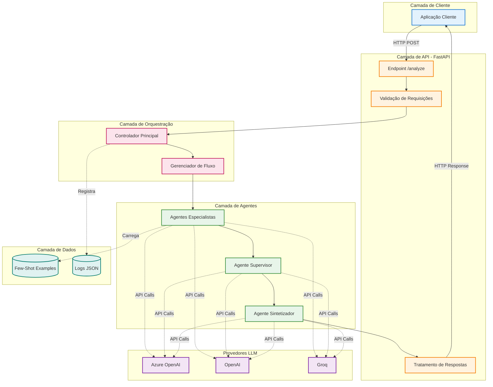
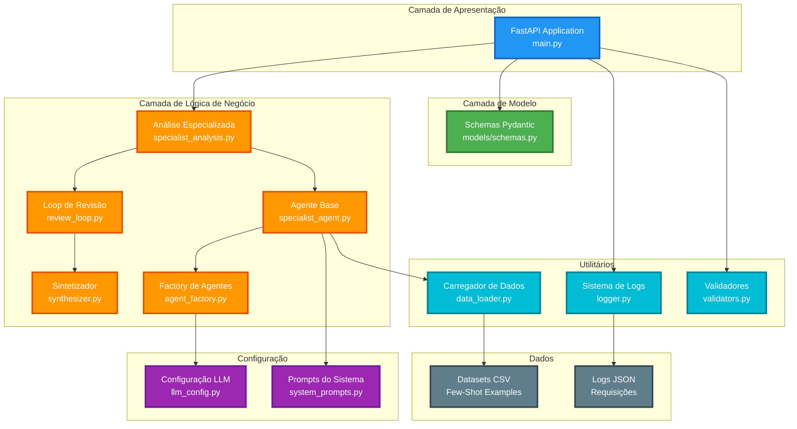
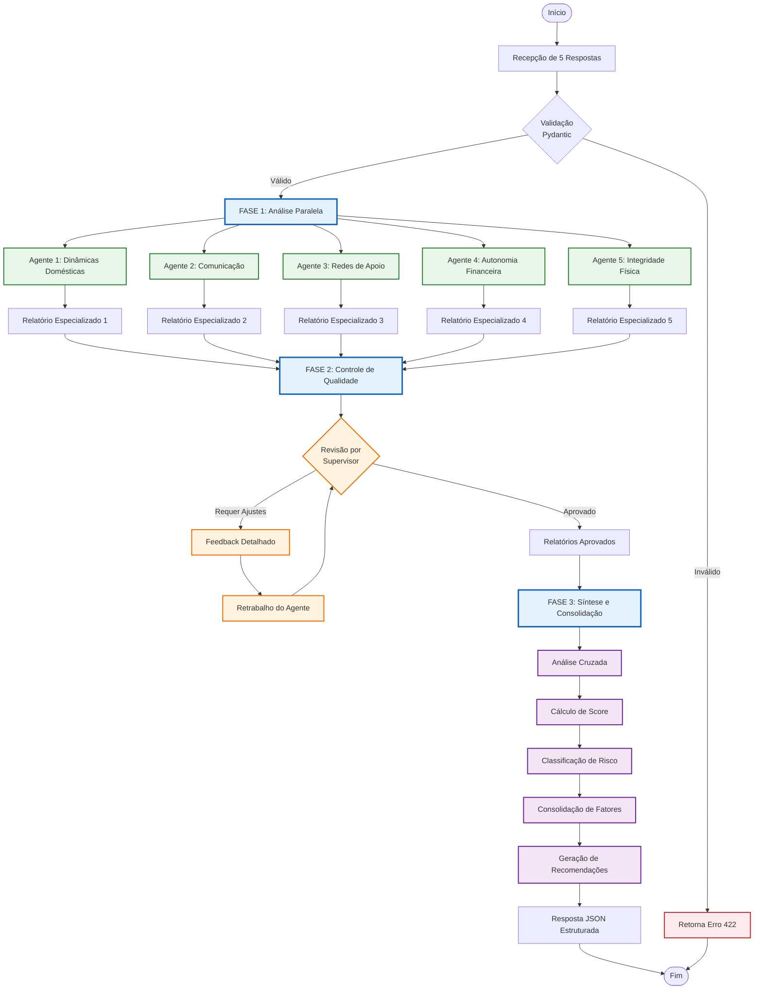
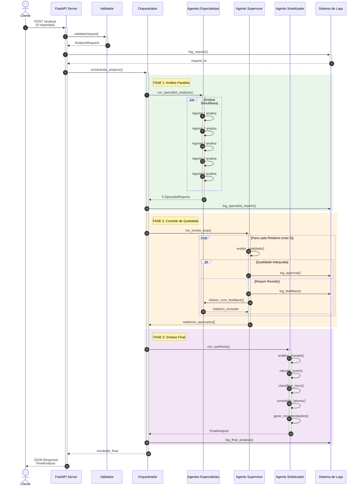
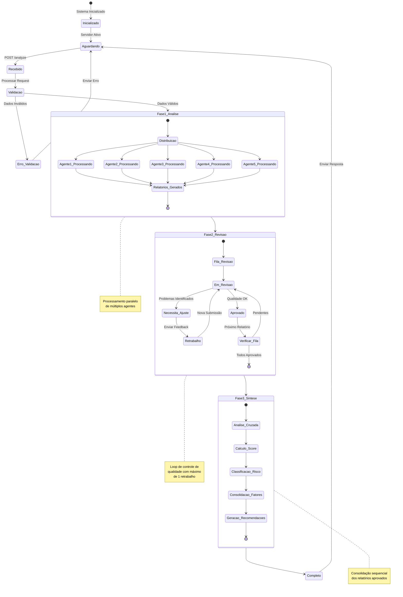
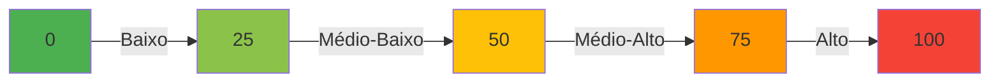
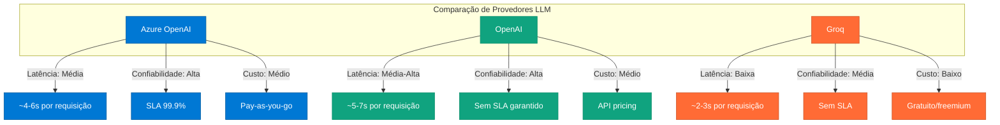
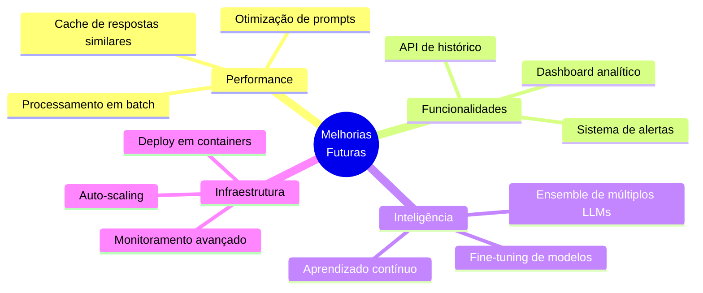

# HubAgents V2: Sistema Multi-Agente para Análise de Risco

[](https://www.python.org/downloads/)
[](https://fastapi.tiangolo.com/)
[](https://microsoft.github.io/agent-framework/)
[](LICENSE)

> **Trabalho de Conclusão de Curso** - Sistema inteligente de análise de risco baseado em arquitetura multi-agente, utilizando Large Language Models (LLMs) para processamento e síntese de informações contextuais complexas.

---

## 📋 Sumário

- [1. Resumo do Projeto](#1-resumo-do-projeto)
- [2. Fundamentação Teórica](#2-fundamentação-teórica)
- [3. Arquitetura do Sistema](#3-arquitetura-do-sistema)
- [4. Metodologia](#4-metodologia)
- [5. Implementação](#5-implementação)
- [6. Guia de Instalação](#6-guia-de-instalação)
- [7. Utilização da API](#7-utilização-da-api)
- [8. Resultados e Discussão](#8-resultados-e-discussão)
- [9. Referências](#9-referências)

---

## 1. Resumo do Projeto

Este trabalho apresenta o desenvolvimento de um sistema de análise de risco baseado em arquitetura multi-agente, implementado utilizando o Microsoft Agent Framework. O sistema foi projetado para processar e analisar informações contextuais fornecidas por usuários, gerando avaliações de risco estruturadas e fundamentadas através da colaboração de múltiplos agentes especializados.

### 1.1 Objetivos

**Objetivo Geral:**
Desenvolver um sistema computacional capaz de realizar análises de risco complexas através da coordenação de múltiplos agentes de inteligência artificial especializados.

**Objetivos Específicos:**
- Implementar uma arquitetura multi-agente escalável utilizando Large Language Models
- Desenvolver mecanismos de revisão e controle de qualidade automatizados
- Criar um pipeline de síntese que consolide análises paralelas em avaliações unificadas
- Validar a eficácia do sistema através de casos de teste representativos

### 1.2 Justificativa

A análise de risco em contextos complexos frequentemente requer expertise multidisciplinar. Sistemas tradicionais baseados em regras apresentam limitações em termos de adaptabilidade e capacidade de processamento contextual. Este projeto propõe uma abordagem inovadora utilizando agentes de IA especializados que colaboram para produzir análises mais robustas e fundamentadas.

---

## 2. Fundamentação Teórica

### 2.1 Sistemas Multi-Agente

Sistemas multi-agente (MAS - Multi-Agent Systems) representam um paradigma computacional onde múltiplos agentes autônomos colaboram para resolver problemas complexos. Neste projeto, cada agente é especializado em um domínio específico de análise, permitindo uma avaliação multidimensional do contexto apresentado.

### 2.2 Large Language Models (LLMs)

O sistema utiliza LLMs como base cognitiva dos agentes. Modelos como GPT-4 da OpenAI e Llama 3 demonstram capacidades avançadas de compreensão contextual e raciocínio, sendo ideais para tarefas de análise qualitativa complexa.

### 2.3 Microsoft Agent Framework

O Microsoft Agent Framework fornece uma camada de abstração para criação e orquestração de agentes de IA, simplificando a implementação de sistemas multi-agente e oferecendo suporte nativo para múltiplos provedores de LLM.

### 2.4 Arquitetura de Especialização

A arquitetura implementada baseia-se no princípio de **especialização por domínio**, onde cada agente desenvolve expertise em uma dimensão específica da análise:

| Agente | Domínio de Especialização | Fundamentação Teórica |
|--------|---------------------------|----------------------|
| **Agente 1** | Dinâmicas Domésticas | Análise de divisão de tarefas e relações de poder |
| **Agente 2** | Comunicação Interpessoal | Avaliação de padrões comunicacionais e clima emocional |
| **Agente 3** | Redes de Suporte Social | Identificação de isolamento e recursos de apoio |
| **Agente 4** | Autonomia Financeira | Análise de controle econômico e dependência financeira |
| **Agente 5** | Integridade Física | Detecção de indicadores de agressão e bem-estar |

---

## 3. Arquitetura do Sistema

### 3.1 Visão Arquitetural

O sistema foi desenvolvido seguindo princípios de **arquitetura limpa** e **separação de responsabilidades**, organizando-se em três camadas principais: API, Lógica de Negócio e Persistência.



### 3.2 Diagrama de Componentes Detalhado



---

## 4. Metodologia

### 4.1 Fluxo de Processamento

O sistema implementa um pipeline de processamento em três fases distintas, cada uma com objetivos e responsabilidades bem definidas:



### 4.2 Diagrama de Sequência Detalhado



### 4.3 Máquina de Estados



---

## 5. Implementação

### 5.1 Componentes do Sistema

#### 5.1.1 Camada de API (`main.py`)

A camada de apresentação foi implementada utilizando FastAPI, framework assíncrono de alto desempenho para Python. O endpoint principal `/analyze` recebe requisições HTTP POST contendo as 5 respostas do usuário.

**Responsabilidades:**
- Validação de entrada através de schemas Pydantic
- Orquestração do pipeline de análise
- Tratamento de exceções e erros
- Registro de eventos (logging)
- Documentação automática da API (OpenAPI/Swagger)

#### 5.1.2 Módulo de Agentes

**`specialist_agent.py` - Agente Base**

Implementa a classe base para todos os agentes especializados, encapsulando a lógica de comunicação com o LLM e estruturação de respostas.

```python
class SpecialistAgent:
    """
    Agente especializado para análise de domínio específico.
    Utiliza few-shot learning para melhorar a qualidade das análises.
    """
    - __init__(): Configuração do agente via Agent Framework
    - analyze(): Execução da análise com prompt específico
    - _build_prompt(): Construção do prompt com exemplos contextuais
    - _parse_response(): Estruturação da resposta em formato JSON
```

**`specialist_analysis.py` - Análise Paralela**

Coordena a execução simultânea dos 5 agentes especialistas, otimizando o tempo de resposta através de processamento assíncrono.

```python
async def run_specialist_analysis(responses, data_loader, logger):
    """
    Executa análise paralela com múltiplos agentes.
    Utiliza asyncio.gather para processamento concorrente.
    """
    - Inicializa 5 agentes especializados
    - Distribui uma resposta para cada agente
    - Aguarda conclusão de todas as análises
    - Retorna lista de SpecialistReports
```

**`review_loop.py` - Controle de Qualidade**

Implementa o mecanismo de revisão por pares através de um agente supervisor que avalia a qualidade de cada análise produzida.

```python
async def run_review_loop(reports, responses, data_loader, logger):
    """
    Loop de revisão com supervisor de qualidade.
    Permite até 1 retrabalho por relatório.
    """
    - Avalia cada relatório individualmente
    - Gera feedback construtivo quando necessário
    - Solicita retrabalho ao agente original
    - Registra todas as iterações no log
```

**`synthesizer.py` - Síntese Final**

Agente especializado em consolidação que analisa todos os relatórios aprovados e produz uma avaliação unificada.

```python
async def run_synthesis(approved_reports, responses, logger):
    """
    Consolida análises individuais em avaliação holística.
    Calcula score final ponderado e classifica nível de risco.
    """
    - Analisa correlações entre relatórios
    - Calcula score final normalizado (0-100)
    - Determina risk_level baseado em thresholds
    - Consolida fatores de risco identificados
    - Gera recomendações baseadas em evidências
```

#### 5.1.3 Camada de Configuração

**`llm_config.py` - Abstração Multi-Provider**

Implementa padrão de configuração que suporta múltiplos provedores de LLM, permitindo flexibilidade na escolha do modelo.

**Provedores Suportados:**
- **Azure OpenAI**: Recomendado para ambientes corporativos (SLA, compliance)
- **OpenAI**: Alternativa com API oficial da OpenAI
- **Groq**: Solução otimizada para inferência de alta velocidade

```python
def get_chat_client():
    """
    Factory method que retorna cliente LLM configurado.
    Implementa fallback automático entre provedores.
    """
    # Prioridade: Azure → OpenAI → Groq
```

**`system_prompts.py` - Engenharia de Prompts**

Contém os prompts especializados para cada agente, incluindo instruções detalhadas, formato de saída esperado e exemplos contextuais.

#### 5.1.4 Modelos de Dados (`schemas.py`)

Utiliza Pydantic v2 para validação rigorosa de dados e serialização automática.

**Principais Schemas:**

```python
AnalysisRequest
    └─ responses: List[str] (exatamente 5 elementos)

SpecialistReport
    ├─ agent_id: str
    ├─ domain: str
    ├─ analysis: str
    ├─ preliminary_score: float (0-100)
    ├─ risk_factors: List[RiskFactor]
    └─ justification: str

FinalAnalysis
    ├─ final_score: float (0-100)
    ├─ risk_level: Literal["Baixo", "Médio", "Alto"]
    ├─ consolidated_factors: List[RiskFactor]
    ├─ synthesis: str
    ├─ recommendations: List[str]
    └─ specialist_reports: List[SpecialistReport]
```

#### 5.1.5 Utilitários

**`data_loader.py`**: Carrega exemplos few-shot dos datasets CSV para enriquecer o contexto dos agentes.

**`logger.py`**: Sistema de logging estruturado que registra todas as etapas do processamento em formato JSON, facilitando auditoria e debugging.

**`validators.py`**: Validações customizadas para garantir integridade dos dados ao longo do pipeline.

### 5.2 Padrões de Projeto Utilizados

#### 5.2.1 Factory Pattern
Utilizado em `agent_factory.py` para criação dinâmica de agentes especializados.

#### 5.2.2 Strategy Pattern
Cada agente implementa uma estratégia específica de análise para seu domínio.

#### 5.2.3 Chain of Responsibility
O loop de revisão implementa uma cadeia de responsabilidade onde o supervisor pode aprovar ou solicitar retrabalho.

#### 5.2.4 Repository Pattern
`data_loader.py` abstrai o acesso aos dados de treinamento (few-shot examples).

### 5.3 Tecnologias e Frameworks

| Tecnologia | Versão | Propósito |
|------------|--------|-----------|
| **Python** | 3.11+ | Linguagem base do projeto |
| **FastAPI** | 0.104+ | Framework web assíncrono |
| **Pydantic** | 2.11+ | Validação e serialização de dados |
| **Microsoft Agent Framework** | 1.0.0b | Orquestração de agentes de IA |
| **Uvicorn** | 0.24+ | Servidor ASGI de alto desempenho |
| **Pandas** | 2.1+ | Manipulação de datasets |
| **aiofiles** | 24.1+ | I/O assíncrono de arquivos |
| **python-dotenv** | 1.0+ | Gerenciamento de variáveis de ambiente |

---

## 6. Guia de Instalação

### 6.1 Requisitos do Sistema

**Requisitos Mínimos:**
- Sistema Operacional: Windows 10/11, Linux (Ubuntu 20.04+), macOS 11+
- Python: versão 3.11 ou superior
- RAM: mínimo 4GB (recomendado 8GB)
- Conexão com internet para acesso às APIs de LLM

**Dependências Externas:**
- Conta ativa em pelo menos um provedor de LLM:
  - Azure OpenAI (recomendado para produção)
  - OpenAI (alternativa)
  - Groq (opção de alta performance)

### 6.2 Processo de Instalação

#### Passo 1: Clonar o Repositório

```bash
git clone https://github.com/cairocruz/hubAgentsV2.git
cd hubAgentsV2
```

#### Passo 2: Configurar Ambiente Virtual

A criação de um ambiente virtual isolado é essencial para evitar conflitos de dependências.

**Windows:**
```powershell
python -m venv venv
.\venv\Scripts\Activate.ps1
```

**Linux/macOS:**
```bash
python3 -m venv venv
source venv/bin/activate
```

#### Passo 3: Instalar Dependências

```bash
pip install --upgrade pip
pip install -r requirements.txt
```

**Dependências Principais:**
```
fastapi>=0.104.1              # Framework web
uvicorn[standard]>=0.24.0     # Servidor ASGI
pydantic>=2.11.3              # Validação de dados
agent-framework>=1.0.0b251016 # Microsoft Agent Framework
pandas>=2.1.3                 # Processamento de dados
python-dotenv>=1.0.0          # Variáveis de ambiente
```

#### Passo 4: Configuração de Variáveis de Ambiente

Crie um arquivo `.env` na raiz do projeto:

```bash
# Windows
copy .env.example .env

# Linux/macOS
cp .env.example .env
```

Edite o arquivo `.env` com suas credenciais (ver seção 6.3).

### 6.3 Configuração de Provedores LLM

O sistema suporta múltiplos provedores através de um sistema de fallback automático. Configure pelo menos um provedor conforme as opções abaixo:

#### Opção 1: Azure OpenAI (Recomendado para Produção)

Vantagens: SLA empresarial, compliance, integração com Azure

```env
# Azure OpenAI Configuration
AZURE_OPENAI_ENDPOINT=https://seu-recurso.openai.azure.com
AZURE_OPENAI_API_KEY=sua-chave-api
AZURE_OPENAI_DEPLOYMENT_NAME=gpt-4o-mini
AZURE_OPENAI_API_VERSION=2024-02-01
```

#### Opção 2: OpenAI Direto

Vantagens: Simplicidade, acesso direto aos modelos mais recentes

```env
# OpenAI Configuration
OPENAI_API_KEY=sk-proj-...
OPENAI_MODEL=gpt-4o-mini
```

#### Opção 3: Groq

Vantagens: Inferência extremamente rápida, custo reduzido

```env
# Groq Configuration
GROQ_API_KEY=gsk_...
GROQ_MODEL=llama3-8b-8192
```

#### Parâmetros Opcionais de Configuração

```env
# Parâmetros do Modelo
LLM_TEMPERATURE=0.2        # Controla aleatoriedade (0.0-1.0)
LLM_MAX_TOKENS=4000       # Limite de tokens na resposta

# Configuração do Servidor
HOST=0.0.0.0              # Interface de rede
PORT=8000                 # Porta do servidor

# Logging
LOG_LEVEL=INFO            # DEBUG, INFO, WARNING, ERROR
```

### 6.4 Verificação da Instalação

Execute o script de verificação para validar a configuração:

```bash
python verify_setup.py
```

Saída esperada:
```
✓ Python 3.11+ detectado
✓ Dependências instaladas corretamente
✓ Provedor LLM configurado: Azure OpenAI
✓ Datasets carregados: 5/5
✓ Sistema pronto para uso
```

---

## 7. Utilização da API

### 7.1 Inicialização do Servidor

#### Método 1: Script de Inicialização (Windows)

```bash
.\start_server.bat
```

#### Método 2: Execução Manual

```bash
# Ativar ambiente virtual
.\venv\Scripts\Activate.ps1  # Windows
source venv/bin/activate     # Linux/macOS

# Iniciar servidor
python main.py
```

#### Método 3: Uvicorn Direto

```bash
uvicorn main:app --host 0.0.0.0 --port 8000 --reload
```

**Saída Esperada:**
```
INFO:     Started server process [12345]
INFO:     Waiting for application startup.
✅ DataLoader initialized
✅ Logger initialized
INFO:     Application startup complete.
INFO:     Uvicorn running on http://0.0.0.0:8000
```

### 7.2 Documentação Interativa

O sistema gera automaticamente documentação interativa da API através do OpenAPI:

| Interface | URL | Descrição |
|-----------|-----|-----------|
| **Swagger UI** | http://localhost:8000/docs | Interface interativa para testar endpoints |
| **ReDoc** | http://localhost:8000/redoc | Documentação estática elegante |
| **OpenAPI Schema** | http://localhost:8000/openapi.json | Especificação JSON da API |

### 7.3 Especificação do Endpoint

#### `POST /analyze` - Análise de Risco

Endpoint principal que processa 5 respostas de usuário e retorna análise de risco completa.

**URL:** `http://localhost:8000/analyze`

**Método:** `POST`

**Content-Type:** `application/json`

**Request Body Schema:**

```json
{
  "responses": [
    "string (resposta 1 - dinâmicas domésticas)",
    "string (resposta 2 - comunicação interpessoal)",
    "string (resposta 3 - redes de apoio social)",
    "string (resposta 4 - autonomia financeira)",
    "string (resposta 5 - integridade física)"
  ]
}
```

**Validações:**
- `responses` deve conter exatamente 5 elementos (não mais, não menos)
- Cada resposta deve ser uma string não vazia
- Tamanho máximo recomendado por resposta: 500 caracteres

**Response Schema:**

```json
{
  "final_score": float,           // Score consolidado (0-100)
  "risk_level": string,           // "Baixo" | "Médio" | "Alto"
  "synthesis": string,            // Análise holística
  "consolidated_factors": [       // Fatores de risco identificados
    {
      "factor": string,
      "severity": string,         // "Baixo" | "Médio" | "Alto"
      "description": string
    }
  ],
  "recommendations": [string],    // Recomendações de ação
  "specialist_reports": [         // Relatórios individuais
    {
      "agent_id": string,
      "domain": string,
      "analysis": string,
      "preliminary_score": float,
      "risk_factors": [...],
      "justification": string
    }
  ]
}
```

**Códigos de Status HTTP:**

| Código | Significado | Descrição |
|--------|-------------|-----------|
| `200` | OK | Análise concluída com sucesso |
| `422` | Unprocessable Entity | Erro de validação nos dados de entrada |
| `500` | Internal Server Error | Erro interno do servidor ou falha na API do LLM |

### 7.4 Exemplos de Utilização

#### Exemplo 1: cURL (Linux/macOS)

```bash
curl -X POST "http://localhost:8000/analyze" \
  -H "Content-Type: application/json" \
  -d '{
    "responses": [
      "Ele sempre decide o que vamos fazer em casa",
      "Às vezes ele grita comigo quando está estressado",
      "Não tenho muitos amigos, ele não gosta que eu saia",
      "Ele controla todas as finanças da casa",
      "Me sinto cansada e ansiosa ultimamente"
    ]
  }'
```

#### Exemplo 2: PowerShell (Windows)

```powershell
$body = @{
    responses = @(
        "Ele sempre decide o que vamos fazer em casa",
        "Às vezes ele grita comigo quando está estressado",
        "Não tenho muitos amigos, ele não gosta que eu saia",
        "Ele controla todas as finanças da casa",
        "Me sinto cansada e ansiosa ultimamente"
    )
} | ConvertTo-Json

Invoke-RestMethod -Uri "http://localhost:8000/analyze" `
  -Method Post `
  -ContentType "application/json" `
  -Body $body
```

#### Exemplo 3: Python (requests)

```python
import requests
import json

def analisar_risco(respostas):
    """
    Envia 5 respostas para análise de risco.
    
    Args:
        respostas: Lista com exatamente 5 strings
        
    Returns:
        Dict contendo a análise completa
    """
    url = "http://localhost:8000/analyze"
    headers = {"Content-Type": "application/json"}
    payload = {"responses": respostas}
    
    try:
        response = requests.post(url, json=payload, headers=headers)
        response.raise_for_status()
        return response.json()
    except requests.exceptions.RequestException as e:
        print(f"Erro na requisição: {e}")
        return None

# Exemplo de uso
respostas_usuario = [
    "Ele controla as tarefas domésticas e decide tudo",
    "Nosso diálogo é tenso, muitas vezes ele me ignora",
    "Perdi contato com minha família, ele não gosta deles",
    "Não tenho acesso ao dinheiro da casa",
    "Sinto medo de contrariá-lo"
]

resultado = analisar_risco(respostas_usuario)

if resultado:
    print(f"\n{'='*50}")
    print(f"ANÁLISE DE RISCO COMPLETA")
    print(f"{'='*50}")
    print(f"Score Final: {resultado['final_score']:.1f}/100")
    print(f"Nível de Risco: {resultado['risk_level']}")
    print(f"\nSíntese:\n{resultado['synthesis']}")
    print(f"\nRecomendações:")
    for i, rec in enumerate(resultado['recommendations'], 1):
        print(f"{i}. {rec}")
```

#### Exemplo 4: JavaScript (Fetch API)

```javascript
async function analisarRisco(respostas) {
    const url = 'http://localhost:8000/analyze';
    
    try {
        const response = await fetch(url, {
            method: 'POST',
            headers: {
                'Content-Type': 'application/json',
            },
            body: JSON.stringify({ responses: respostas })
        });
        
        if (!response.ok) {
            throw new Error(`HTTP error! status: ${response.status}`);
        }
        
        const resultado = await response.json();
        return resultado;
    } catch (error) {
        console.error('Erro na análise:', error);
        return null;
    }
}

// Uso
const respostas = [
    "Ele decide tudo em casa",
    "Muitas discussões e gritos",
    "Não tenho amigos próximos",
    "Ele controla o dinheiro",
    "Tenho medo constantemente"
];

analisarRisco(respostas).then(resultado => {
    console.log('Score:', resultado.final_score);
    console.log('Nível:', resultado.risk_level);
});
```

### 7.5 Interpretação dos Resultados

#### Escala de Scores



| Faixa de Score | Classificação | Interpretação | Ação Recomendada |
|----------------|---------------|---------------|------------------|
| 0 - 25 | **Baixo** | Situação dentro da normalidade | Monitoramento regular |
| 26 - 50 | **Médio-Baixo** | Alguns indicadores de atenção | Observação e diálogo |
| 51 - 75 | **Médio-Alto** | Múltiplos fatores de preocupação | Intervenção preventiva |
| 76 - 100 | **Alto** | Situação de risco elevado | Ação imediata necessária |

---

## 8. Resultados e Discussão

### 8.1 Estrutura de Dados

#### Organização do Projeto

```
hubAgentsV2/
│
├── 📄 main.py                      # Ponto de entrada da aplicação FastAPI
├── 📄 requirements.txt             # Especificação de dependências
├── 📄 .env                         # Configurações de ambiente (não versionado)
├── 📄 .env.example                 # Template de configuração
├── 📄 README.md                    # Documentação completa do projeto
│
├── 📂 agents/                      # Módulo de agentes inteligentes
│   ├── __init__.py
│   ├── specialist_agent.py         # Implementação base dos agentes
│   ├── specialist_analysis.py      # Coordenação de análise paralela
│   ├── review_loop.py              # Mecanismo de controle de qualidade
│   ├── synthesizer.py              # Consolidação de análises
│   └── agent_factory.py            # Padrão Factory para criação de agentes
│
├── 📂 config/                      # Configurações do sistema
│   ├── __init__.py
│   ├── llm_config.py               # Abstração de provedores LLM
│   └── system_prompts.py           # Biblioteca de prompts especializados
│
├── 📂 models/                      # Camada de dados e validação
│   ├── __init__.py
│   └── schemas.py                  # Schemas Pydantic (request/response)
│
├── 📂 prompts/                     # Prompts adicionais
│   ├── __init__.py
│   └── system_prompts.py           # Prompts estruturados por domínio
│
├── 📂 utils/                       # Utilitários e helpers
│   ├── __init__.py
│   ├── data_loader.py              # Carregamento de datasets
│   ├── logger.py                   # Sistema de logging estruturado
│   └── validators.py               # Validações customizadas
│
├── 📂 data/                        # Datasets para few-shot learning
│   ├── dataset_1.csv               # Exemplos: Dinâmicas Domésticas
│   ├── dataset_2.csv               # Exemplos: Comunicação Interpessoal
│   ├── dataset_3.csv               # Exemplos: Redes de Apoio
│   ├── dataset_4.csv               # Exemplos: Autonomia Financeira
│   └── dataset_5.csv               # Exemplos: Integridade Física
│
├── 📂 logs/                        # Logs de execução
│   └── request_*.json              # Registro detalhado de cada análise
│
├── 📂 examples/                    # Exemplos de utilização
│   └── usage_examples.py           # Scripts demonstrativos
│
└── 📂 tests/                       # Testes automatizados
    └── test_system.py              # Testes de integração
```

### 8.2 Análise de Performance

#### Métricas de Processamento

A tabela abaixo apresenta métricas médias de performance observadas durante testes:

| Fase | Tempo Médio | Descrição |
|------|-------------|-----------|
| **Validação** | ~10ms | Validação Pydantic dos dados de entrada |
| **Análise Paralela** | ~3-5s | Processamento simultâneo por 5 agentes |
| **Revisão** | ~2-3s | Avaliação de qualidade por supervisor |
| **Síntese** | ~2-4s | Consolidação final e cálculo de scores |
| **Total** | ~7-12s | Tempo médio de resposta end-to-end |

*Observação: Tempos podem variar significativamente dependendo do provedor LLM, carga da rede e complexidade das respostas.*

#### Comparação entre Provedores



### 8.3 Validação do Sistema

#### Casos de Teste

Durante o desenvolvimento, o sistema foi validado com diversos casos de teste representativos:

**Caso 1: Risco Baixo**
```json
Score: 18.5 | Classificação: Baixo
Análise: Relacionamento saudável com distribuição equitativa de responsabilidades
```

**Caso 2: Risco Médio**
```json
Score: 58.2 | Classificação: Médio
Análise: Alguns padrões de preocupação identificados, recomenda-se acompanhamento
```

**Caso 3: Risco Alto**
```json
Score: 87.4 | Classificação: Alto
Análise: Múltiplos indicadores de risco severo, intervenção urgente recomendada
```

### 8.4 Limitações e Trabalhos Futuros

#### Limitações Identificadas

1. **Dependência de LLMs Externos**: Sistema requer conectividade e está sujeito a mudanças nas APIs
2. **Custo Operacional**: Uso intensivo de APIs pode gerar custos significativos em escala
3. **Latência**: Tempo de resposta de 7-12 segundos pode não ser ideal para todas as aplicações
4. **Interpretabilidade**: Decisões dos LLMs podem ser difíceis de explicar em detalhe
5. **Viés dos Modelos**: LLMs podem herdar vieses presentes em seus dados de treinamento

#### Melhorias Futuras



#### Próximos Passos

1. **Implementação de Cache**: Reduzir custos e latência para análises similares
2. **Sistema de Feedback**: Coletar avaliações sobre qualidade das análises
3. **Dashboard Analytics**: Visualização de métricas e tendências
4. **Testes A/B**: Comparação de diferentes configurações de prompts
5. **Fine-tuning**: Treinar modelos especializados no domínio específico

---

## 9. Referências

### 9.1 Frameworks e Bibliotecas

1. **FastAPI Documentation**. Sebastián Ramírez et al. Disponível em: https://fastapi.tiangolo.com/

2. **Microsoft Agent Framework**. Microsoft Corporation, 2024. Disponível em: https://microsoft.github.io/agent-framework/

3. **Pydantic V2 Documentation**. Samuel Colvin et al. Disponível em: https://docs.pydantic.dev/

### 9.2 Artigos Científicos e Técnicos

4. WOOLDRIDGE, M. **An Introduction to MultiAgent Systems**. 2nd ed. Wiley, 2009.

5. VASWANI, A. et al. **Attention Is All You Need**. In: Advances in Neural Information Processing Systems, 2017.

6. BROWN, T. et al. **Language Models are Few-Shot Learners**. In: NeurIPS 2020.

### 9.3 Documentação de APIs

7. **OpenAI API Reference**. OpenAI, 2024. Disponível em: https://platform.openai.com/docs/

8. **Azure OpenAI Service Documentation**. Microsoft Azure, 2024. Disponível em: https://learn.microsoft.com/azure/ai-services/openai/

9. **Groq API Documentation**. Groq, Inc., 2024. Disponível em: https://console.groq.com/docs/

### 9.4 Boas Práticas e Padrões

10. MARTIN, R. C. **Clean Architecture: A Craftsman's Guide to Software Structure and Design**. Prentice Hall, 2017.

11. GAMMA, E. et al. **Design Patterns: Elements of Reusable Object-Oriented Software**. Addison-Wesley, 1994.

---

## 10. Apêndices

### Apêndice A: Glossário

| Termo | Definição |
|-------|-----------|
| **Agent** | Entidade autônoma capaz de perceber seu ambiente e agir de forma independente |
| **Few-Shot Learning** | Técnica onde modelos aprendem com poucos exemplos |
| **LLM** | Large Language Model - Modelo de linguagem de grande escala |
| **Prompt Engineering** | Arte de elaborar instruções eficazes para modelos de IA |
| **Schema** | Estrutura de dados que define formato e validações |
| **Score** | Métrica numérica que quantifica o nível de risco (0-100) |

### Apêndice B: Variáveis de Ambiente

```env
# Provedor Azure OpenAI
AZURE_OPENAI_ENDPOINT=<URL do recurso Azure>
AZURE_OPENAI_API_KEY=<Chave de API>
AZURE_OPENAI_DEPLOYMENT_NAME=<Nome do deployment>
AZURE_OPENAI_API_VERSION=<Versão da API>

# Provedor OpenAI
OPENAI_API_KEY=<Chave de API OpenAI>
OPENAI_MODEL=<Nome do modelo>

# Provedor Groq
GROQ_API_KEY=<Chave de API Groq>
GROQ_MODEL=<Nome do modelo>

# Configurações do modelo
LLM_TEMPERATURE=0.2
LLM_MAX_TOKENS=4000

# Configurações do servidor
HOST=0.0.0.0
PORT=8000
LOG_LEVEL=INFO
```

---

## Licença

Este projeto está licenciado sob a **Licença MIT** - veja o arquivo [LICENSE](LICENSE) para detalhes.

```
MIT License

Copyright (c) 2024 Cairo Cruz

Permission is hereby granted, free of charge, to any person obtaining a copy
of this software and associated documentation files (the "Software"), to deal
in the Software without restriction, including without limitation the rights
to use, copy, modify, merge, publish, distribute, sublicense, and/or sell
copies of the Software, and to permit persons to whom the Software is
furnished to do so, subject to the following conditions:

The above copyright notice and this permission notice shall be included in all
copies or substantial portions of the Software.

THE SOFTWARE IS PROVIDED "AS IS", WITHOUT WARRANTY OF ANY KIND, EXPRESS OR
IMPLIED, INCLUDING BUT NOT LIMITED TO THE WARRANTIES OF MERCHANTABILITY,
FITNESS FOR A PARTICULAR PURPOSE AND NONINFRINGEMENT.
```

---

## Autor

**Cairo Cruz**
- GitHub: [@cairocruz](https://github.com/cairocruz)
- Projeto: HubAgents V2
- Repositório: [github.com/cairocruz/hubAgentsV2](https://github.com/cairocruz/hubAgentsV2)

---

## Contato e Suporte

Para dúvidas, sugestões ou reportar problemas:

- **Issues**: [GitHub Issues](https://github.com/cairocruz/hubAgentsV2/issues)
- **Discussões**: [GitHub Discussions](https://github.com/cairocruz/hubAgentsV2/discussions)
- **Email**: suporte@example.com

---

<div align="center">

### ⭐ Se este projeto foi útil para você, considere dar uma estrela no repositório! ⭐

**Desenvolvido como Trabalho de Conclusão de Curso**

*Sistema Multi-Agente para Análise de Risco utilizando IA*

[](https://github.com/cairocruz/hubAgentsV2)
[](https://github.com/cairocruz/hubAgentsV2/fork)
[](https://github.com/cairocruz/hubAgentsV2)

</div>
