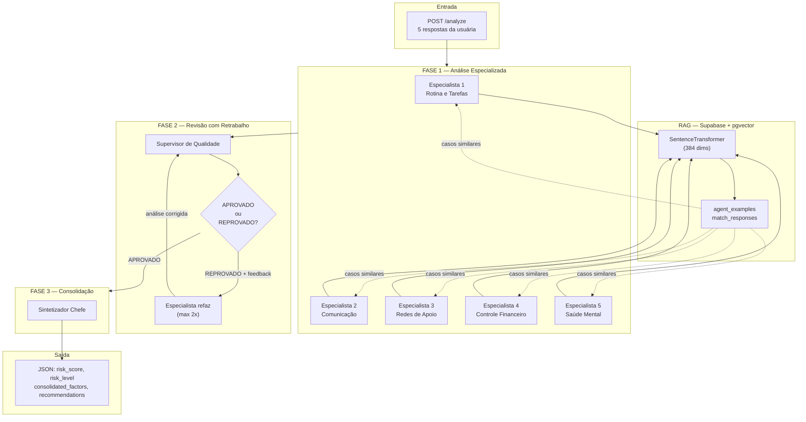
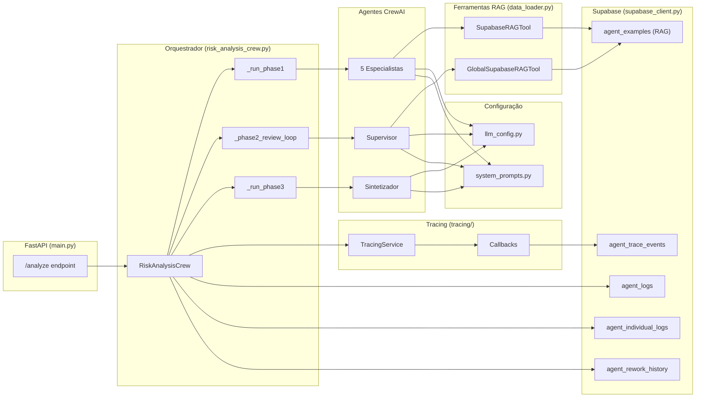
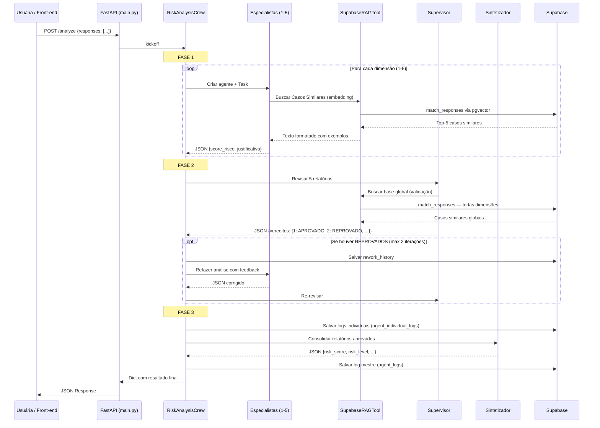
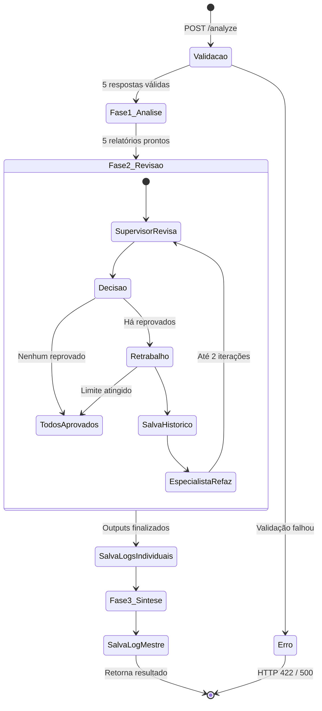
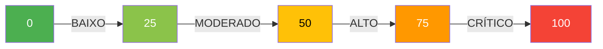
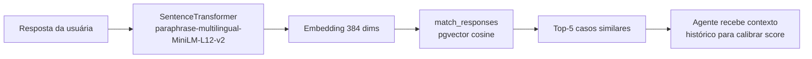
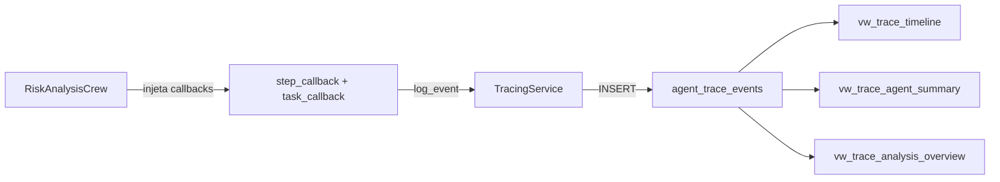
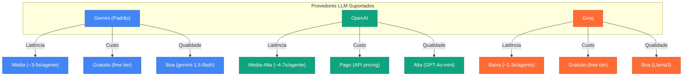

# HubAgents V2: Sistema Multi-Agente para Análise de Risco

[](https://www.python.org/downloads/)
[](https://fastapi.tiangolo.com/)
[](https://crewai.com/)
[](https://supabase.com/)
[](LICENSE)

> **Trabalho de Conclusão de Curso** — Sistema inteligente de análise de risco baseado em arquitetura multi-agente, utilizando Large Language Models (LLMs) para processamento e síntese de informações contextuais complexas via **CrewAI**, com busca RAG (Retrieval-Augmented Generation) no **Supabase + pgvector**.

---

## Sumário

1. [Visão Geral](#1-visão-geral)
2. [Arquitetura do Sistema](#2-arquitetura-do-sistema)
3. [Estrutura do Projeto](#3-estrutura-do-projeto)
4. [Stack Tecnológica](#4-stack-tecnológica)
5. [Instalação e Configuração](#5-instalação-e-configuração)
6. [API REST](#6-api-rest)
7. [Banco de Dados (Supabase)](#7-banco-de-dados-supabase)
8. [Tracing e Observabilidade](#8-tracing-e-observabilidade)
9. [Resultados e Discussão](#9-resultados-e-discussão)
10. [Referências](#10-referências)
11. [Licença e Autor](#11-licença-e-autor)

---

## 1. Visão Geral

O **HubAgents V2** é um sistema de avaliação de risco de violência doméstica que orquestra **7 agentes de IA** em 3 fases, utilizando o framework **CrewAI** para coordenação multiagente e **Supabase com pgvector** para RAG (busca de casos históricos similares por similaridade semântica).

### Fundamentação

| Conceito | Aplicação no Projeto |
|---|---|
| **Multi-Agent System** | 5 especialistas + 1 supervisor + 1 sintetizador |
| **RAG (Retrieval-Augmented Generation)** | Busca de casos históricos no Supabase via pgvector antes de cada análise |
| **Few-Shot Learning** | Exemplos do banco ajudam o LLM a calibrar scores |
| **Prompt Engineering** | Prompts estruturados por domínio de risco |
| **Quality Gate** | Supervisor revisa e pode reprovar análises (loop de retrabalho) |

### Especialização dos Agentes

| ID | Domínio de Expertise | Descrição |
|----|---|---|
| 1 | Rotina, Sobrecarga e Divisão de Tarefas Domésticas | Avalia desequilíbrios de poder na dinâmica doméstica |
| 2 | Tom Emocional, Comunicação e Intimidação | Identifica padrões de violência verbal/emocional |
| 3 | Redes de Apoio, Isolamento Social e Vínculos | Detecta isolamento social e controle de vínculos |
| 4 | Controle Financeiro e Dependência Econômica | Analisa vulnerabilidade financeira e coerção patrimonial |
| 5 | Bem-estar Físico, Psicológico e Saúde Mental | Avalia impactos na saúde e integridade da vítima |

---

## 2. Arquitetura do Sistema

### 2.1 Fluxo das 3 Fases


```mermaid
flowchart TB
    subgraph INPUT["Entrada"]
        REQ["POST /analyze<br/>5 respostas da usuária"]
    end

    subgraph PHASE1["FASE 1 — Análise Especializada"]
        direction LR
        E1["Especialista 1<br/>Rotina e Tarefas"]
        E2["Especialista 2<br/>Comunicação"]
        E3["Especialista 3<br/>Redes de Apoio"]
        E4["Especialista 4<br/>Controle Financeiro"]
        E5["Especialista 5<br/>Saúde Mental"]
    end

    subgraph RAG["RAG — Supabase + pgvector"]
        EMB["SentenceTransformer<br/>(384 dims)"]
        DB["agent_examples<br/>match_responses"]
    end

    subgraph PHASE2["FASE 2 — Revisão com Retrabalho"]
        SUP["Supervisor de Qualidade"]
        DEC{APROVADO<br/>ou<br/>REPROVADO?}
        RW["Especialista refaz<br/>(max 2x)"]
    end

    subgraph PHASE3["FASE 3 — Consolidação"]
        SYN["Sintetizador Chefe"]
    end

    subgraph OUTPUT["Saída"]
        RES["JSON: risk_score, risk_level<br/>consolidated_factors, recommendations"]
    end

    REQ --> PHASE1
    E1 & E2 & E3 & E4 & E5 --> EMB --> DB
    DB -.->|casos similares| E1 & E2 & E3 & E4 & E5
    PHASE1 --> SUP
    SUP --> DEC
    DEC -->|APROVADO| PHASE3
    DEC -->|REPROVADO + feedback| RW
    RW -->|análise corrigida| SUP
    SYN --> RES
```

### 2.2 Componentes e Dependências


```mermaid
graph LR
    subgraph API["FastAPI (main.py)"]
        EP["/analyze endpoint"]
    end

    subgraph CREW["Orquestrador (risk_analysis_crew.py)"]
        RC["RiskAnalysisCrew"]
        P1["_run_phase1"]
        P2["_phase2_review_loop"]
        P3["_run_phase3"]
    end

    subgraph AGENTS["Agentes CrewAI"]
        SP["5 Especialistas"]
        SV["Supervisor"]
        SN["Sintetizador"]
    end

    subgraph TOOLS["Ferramentas RAG (data_loader.py)"]
        SRT["SupabaseRAGTool"]
        GRT["GlobalSupabaseRAGTool"]
    end

    subgraph DB["Supabase (supabase_client.py)"]
        AE["agent_examples (RAG)"]
        AL["agent_logs"]
        AI["agent_individual_logs"]
        AR["agent_rework_history"]
        AT["agent_trace_events"]
    end

    subgraph TRACING["Tracing (tracing/)"]
        TS["TracingService"]
        CB["Callbacks"]
    end

    subgraph CONFIG["Configuração"]
        LLM["llm_config.py"]
        PR["system_prompts.py"]
    end

    EP --> RC
    RC --> P1 --> SP
    RC --> P2 --> SV
    RC --> P3 --> SN
    SP --> SRT --> AE
    SV --> GRT --> AE
    SP & SV & SN --> LLM
    SP & SV & SN --> PR
    RC --> TS
    TS --> CB
    CB --> AT
    RC --> AL & AI & AR
```

### 2.3 Diagrama de Sequência


```mermaid
sequenceDiagram
    participant U as Usuária / Front-end
    participant API as FastAPI (main.py)
    participant CREW as RiskAnalysisCrew
    participant E as Especialistas (1-5)
    participant RAG as SupabaseRAGTool
    participant SUP as Supervisor
    participant SYN as Sintetizador
    participant DB as Supabase

    U->>API: POST /analyze {responses: [...]}
    API->>CREW: kickoff
    
    Note over CREW: FASE 1

    loop Para cada dimensão (1-5)
        CREW->>E: Criar agente + Task
        E->>RAG: Buscar Casos Similares (embedding)
        RAG->>DB: match_responses via pgvector
        DB-->>RAG: Top-5 casos similares
        RAG-->>E: Texto formatado com exemplos
        E-->>CREW: JSON {score_risco, justificativa}
    end

    Note over CREW: FASE 2

    CREW->>SUP: Revisar 5 relatórios
    SUP->>RAG: Buscar base global (validação)
    RAG->>DB: match_responses — todas dimensões
    DB-->>RAG: Casos similares globais
    SUP-->>CREW: JSON {vereditos: {1: APROVADO, 2: REPROVADO, ...}}
    
    opt Se houver REPROVADOS (max 2 iterações)
        CREW->>DB: Salvar rework_history
        CREW->>E: Refazer análise com feedback
        E-->>CREW: JSON corrigido
        CREW->>SUP: Re-revisar
    end
    
    Note over CREW: FASE 3

    CREW->>DB: Salvar logs individuais (agent_individual_logs)
    CREW->>SYN: Consolidar relatórios aprovados
    SYN-->>CREW: JSON {risk_score, risk_level, ...}
    CREW->>DB: Salvar log mestre (agent_logs)
    CREW-->>API: Dict com resultado final
    API-->>U: JSON Response
```

### 2.4 Máquina de Estados da Análise


```mermaid
stateDiagram-v2
    [*] --> Validacao: POST /analyze
    Validacao --> Fase1_Analise: 5 respostas válidas
    Validacao --> Erro: Validação falhou
    
    Fase1_Analise --> Fase2_Revisao: 5 relatórios prontos
    
    state Fase2_Revisao {
        [*] --> SupervisorRevisa
        SupervisorRevisa --> Decisao
        Decisao --> TodosAprovados: Nenhum reprovado
        Decisao --> Retrabalho: Há reprovados
        Retrabalho --> SalvaHistorico
        SalvaHistorico --> EspecialistaRefaz
        EspecialistaRefaz --> SupervisorRevisa: Até 2 iterações
        Retrabalho --> TodosAprovados: Limite atingido
    }
    
    Fase2_Revisao --> SalvaLogsIndividuais: Outputs finalizados
    SalvaLogsIndividuais --> Fase3_Sintese
    Fase3_Sintese --> SalvaLogMestre
    SalvaLogMestre --> [*]: Retorna resultado
    Erro --> [*]: HTTP 422 / 500
```

---

## 3. Estrutura do Projeto

```
hubAgentsV2/
│
├── main.py                          # Servidor FastAPI — endpoints e lifespan
├── requirements.txt                 # Dependências Python (pip)
├── start_server.bat                 # Script para iniciar o servidor no Windows
├── .env                             # Variáveis de ambiente (não versionado)
├── README.md                        # Esta documentação
│
├── agents/                          # Orquestração multiagente
│   ├── __init__.py
│   └── risk_analysis_crew.py        # RiskAnalysisCrew: 3 fases, 7 agentes, loop de retrabalho
│
├── config/                          # Configuração do sistema
│   ├── __init__.py
│   └── llm_config.py               # Seleção de provedor LLM (Gemini/OpenAI/Groq)
│
├── models/                          # Schemas de dados (Pydantic v2)
│   ├── __init__.py
│   └── schemas.py                   # AnalysisRequest, RiskFactor, SpecialistReport, FinalAnalysis
│
├── prompts/                         # Prompt engineering
│   ├── __init__.py
│   └── system_prompts.py            # DOMAIN_DESCRIPTIONS e AGENT_QUESTIONS por dimensão
│
├── utils/                           # Utilidades e integrações
│   ├── __init__.py
│   ├── data_loader.py               # Ferramentas RAG: SupabaseRAGTool + GlobalSupabaseRAGTool
│   ├── supabase_client.py           # Wrapper Supabase (logs, RAG, rework)
│   ├── validators.py                # Validação de chaves de API
│   └── setup_supabase.py            # Script de migração: cria tabelas + popula dados
│
├── tracing/                         # Observabilidade (100% desacoplado)
│   ├── __init__.py                  # Exports: TracingService, callbacks, TRACING_SQL
│   ├── service.py                   # TracingService: log_event(), set_phase()
│   ├── callbacks.py                 # create_step_callback(), create_task_callback()
│   └── schema.py                    # SQL da tabela agent_trace_events + 3 views
│
├── data/                            # Datasets para RAG (few-shot learning)
│   ├── dataset_1.csv                # Rotina, Sobrecarga e Divisão de Tarefas
│   ├── dataset_2.csv                # Tom Emocional, Comunicação e Intimidação
│   ├── dataset_3.csv                # Redes de Apoio, Isolamento Social
│   ├── dataset_4.csv                # Controle Financeiro, Dependência Econômica
│   └── dataset_5.csv                # Bem-estar Físico, Psicológico e Saúde Mental
│
├── examples/                        # Exemplos de uso
│   └── usage_examples.py            # Scripts demonstrativos para a API
│
├── tests/                           # Testes
│   └── test_system.py               # Testes de integração
│
└── docs/                            # Documentação complementar
    ├── ARCHITECTURE.md
    ├── FINAL_SUMMARY.md
    └── README_COMPLETO.md
```

---

## 4. Stack Tecnológica

| Tecnologia | Versão | Papel no Sistema |
|---|---|---|
| **Python** | 3.13 | Linguagem principal |
| **FastAPI** | ≥ 0.104 | Servidor HTTP assíncrono + documentação Swagger |
| **Uvicorn** | ≥ 0.24 | Servidor ASGI (runtime do FastAPI) |
| **CrewAI** | ≥ 0.80 (v1.9.3) | Orquestração multiagente (Agent, Task, Crew, Process) |
| **LiteLLM** | (interno ao CrewAI) | Abstração de provedores LLM (Gemini, OpenAI, Groq) |
| **Pydantic** | v2 (≥ 2.5) | Validação de schemas de entrada/saída |
| **Supabase** | ≥ 2.4 | Banco de dados PostgreSQL gerenciado (RAG + logs) |
| **pgvector** | (extensão PostgreSQL) | Busca por similaridade de embeddings |
| **SentenceTransformer** | ≥ 2.5 | Modelo `paraphrase-multilingual-MiniLM-L12-v2` (384 dims) |
| **NumPy** | (transitividade) | Operações vetoriais no fallback local de RAG |

### Provedores LLM Suportados

| Provedor | Modelo Padrão | Variável de Ambiente |
|---|---|---|
| **Gemini** (padrão) | `gemini/gemini-1.5-flash` | `GEMINI_API_KEY` |
| **OpenAI** | `openai/gpt-4o-mini` | `OPENAI_API_KEY` |
| **Groq** | `openai/llama3-8b-8192` | `GROQ_API_KEY` |

---

## 5. Instalação e Configuração

### 5.1 Pré-requisitos

- Python 3.13+
- Conta no [Supabase](https://supabase.com/) (gratuito) com extensão `pgvector` habilitada
- Chave de API de pelo menos um provedor LLM (Gemini, OpenAI ou Groq)

### 5.2 Instalação

```bash
# Clonar o repositório
git clone https://github.com/cairocruz/hubAgentsV2.git
cd hubAgentsV2

# Criar e ativar o ambiente virtual
python -m venv .venv

# Windows (PowerShell)
.venv\Scripts\Activate.ps1

# Windows (CMD)
.venv\Scripts\activate.bat

# Linux/macOS
source .venv/bin/activate

# Instalar dependências
pip install -r requirements.txt
```

### 5.3 Variáveis de Ambiente

Crie um arquivo `.env` na raiz do projeto:

```env
# ============================================
# Provedor LLM (escolha um: gemini, openai, groq)
# ============================================
LLM_PROVIDER=gemini

# Gemini (padrão)
GEMINI_API_KEY=sua_chave_gemini
GEMINI_MODEL=gemini/gemini-1.5-flash

# OpenAI (opcional)
OPENAI_API_KEY=sua_chave_openai
OPENAI_MODEL=openai/gpt-4o-mini

# Groq (opcional)
GROQ_API_KEY=sua_chave_groq
GROQ_MODEL=llama3-8b-8192

# ============================================
# Hiperparâmetros do modelo
# ============================================
LLM_TEMPERATURE=0.2
LLM_MAX_TOKENS=4000

# ============================================
# Supabase
# ============================================
SUPABASE_URL=https://seu-projeto.supabase.co
SUPABASE_KEY=sua_service_role_key

# ============================================
# Servidor
# ============================================
HOST=0.0.0.0
PORT=8000
```

### 5.4 Iniciar o Servidor

```bash
# Opção 1 — Diretamente com Uvicorn
uvicorn main:app --host 0.0.0.0 --port 8000 --reload

# Opção 2 — Via Python
python main.py

# Opção 3 — Script Windows (start_server.bat)
.\start_server.bat
```

Após iniciar, acesse:
- **Swagger UI**: http://localhost:8000/docs
- **ReDoc**: http://localhost:8000/redoc
- **Health Check**: http://localhost:8000/health

---

## 6. API REST

### 6.1 Endpoints

| Método | Rota | Descrição |
|---|---|---|
| `GET` | `/` | Informações da API e lista de endpoints |
| `GET` | `/health` | Health check (status do servidor e Supabase) |
| `POST` | `/analyze` | Análise de risco multiagente (3 fases) |
| `GET` | `/docs` | Documentação Swagger UI |
| `GET` | `/redoc` | Documentação ReDoc |

### 6.2 POST /analyze — Requisição

```json
{
  "responses": [
    "Ele me xingou algumas vezes durante discussões",
    "Sim, ele quebrou objetos na casa quando ficou irritado",
    "Ele não gosta quando eu saio com minhas amigas",
    "Tenho uma amiga próxima que me apoia",
    "Estou preocupada com o comportamento dele ultimamente"
  ]
}
```

> **Regra**: o campo `responses` deve conter **exatamente 5 strings** (uma por dimensão de risco).

### 6.3 POST /analyze — Resposta

```json
{
  "risk_score": 72,
  "risk_level": "ALTO",
  "consolidated_factors": [
    "Agressão verbal recorrente durante discussões",
    "Intimidação física indireta (quebra de objetos)",
    "Controle de vínculos sociais e isolamento",
    "Ambiente de estresse e tensão constante"
  ],
  "recommendations": [
    "Procurar apoio de organizações especializadas em violência doméstica",
    "Manter contato com rede de apoio (amiga próxima)",
    "Considerar acompanhamento psicológico",
    "Documentar ocorrências para eventual denúncia"
  ],
  "analysis_id": "a1b2c3d4-e5f6-7890-abcd-ef1234567890",
  "_meta": {
    "duration_seconds": 45.23,
    "max_rework_iterations": 2
  }
}
```

### 6.4 Escala de Classificação de Risco


```mermaid
graph LR
    A["0"] -->|BAIXO| B["25"]
    B -->|MODERADO| C["50"]
    C -->|ALTO| D["75"]
    D -->|CRÍTICO| E["100"]

    style A fill:#4CAF50,color:#fff
    style B fill:#8BC34A,color:#fff
    style C fill:#FFC107,color:#000
    style D fill:#FF9800,color:#fff
    style E fill:#F44336,color:#fff
```

| Faixa de Score | Classificação | Interpretação | Ação Recomendada |
|---|---|---|---|
| 0 – 25 | **BAIXO** | Situação dentro da normalidade | Monitoramento regular |
| 26 – 50 | **MODERADO** | Alguns indicadores de atenção | Observação e diálogo |
| 51 – 75 | **ALTO** | Múltiplos fatores de preocupação | Intervenção preventiva |
| 76 – 100 | **CRÍTICO** | Situação de risco elevado | Ação imediata necessária |

### 6.5 Exemplos de Uso

#### cURL

```bash
curl -X POST http://localhost:8000/analyze \
  -H "Content-Type: application/json" \
  -d '{
    "responses": [
      "Ele controla as tarefas domésticas e decide tudo",
      "Nosso diálogo é tenso, muitas vezes ele me ignora",
      "Perdi contato com minha família, ele não gosta deles",
      "Não tenho acesso ao dinheiro da casa",
      "Sinto medo de contrariá-lo"
    ]
  }'
```

#### Python (requests)

```python
import requests

resultado = requests.post(
    "http://localhost:8000/analyze",
    json={
        "responses": [
            "Ele controla as tarefas domésticas e decide tudo",
            "Nosso diálogo é tenso, muitas vezes ele me ignora",
            "Perdi contato com minha família, ele não gosta deles",
            "Não tenho acesso ao dinheiro da casa",
            "Sinto medo de contrariá-lo"
        ]
    },
).json()

print(f"Score: {resultado['risk_score']}")
print(f"Nível: {resultado['risk_level']}")
for rec in resultado.get("recommendations", []):
    print(f"  • {rec}")
```

#### JavaScript (Fetch)

```javascript
const resultado = await fetch("http://localhost:8000/analyze", {
  method: "POST",
  headers: { "Content-Type": "application/json" },
  body: JSON.stringify({
    responses: [
      "Ele decide tudo em casa",
      "Muitas discussões e gritos",
      "Não tenho amigos próximos",
      "Ele controla o dinheiro",
      "Tenho medo constantemente",
    ],
  }),
}).then((r) => r.json());

console.log("Score:", resultado.risk_score);
console.log("Nível:", resultado.risk_level);
```

---

## 7. Banco de Dados (Supabase)

### 7.1 Tabelas

O sistema utiliza 5 tabelas no Supabase:

| Tabela | Responsável | Descrição |
|---|---|---|
| `agent_examples` | RAG | Casos históricos com embeddings (pgvector, 384 dims) |
| `agent_logs` | Sintetizador | Log mestre: resultado final de cada análise |
| `agent_individual_logs` | Especialistas | Log detalhado por especialista (score, RAG, veredito) |
| `agent_rework_history` | Supervisor | Histórico de análises reprovadas + feedback |
| `agent_trace_events` | Tracing | Eventos granulares de execução dos agentes |

### 7.2 Fluxo RAG


```mermaid
flowchart LR
    RESP["Resposta da usuária"] --> EMB["SentenceTransformer<br/>paraphrase-multilingual-MiniLM-L12-v2"]
    EMB --> VEC["Embedding 384 dims"]
    VEC --> RPC["match_responses<br/>pgvector cosine"]
    RPC --> TOP["Top-5 casos similares"]
    TOP --> AGENT["Agente recebe contexto<br/>histórico para calibrar score"]
```

A função RPC `match_responses` é chamada via Supabase SDK:
- **Entrada**: embedding (384 dims), agent_id (1-5 ou null), limit (5)
- **Saída**: frases similares com `frase`, `risco`, `fator`, `taxonomia`, `similarity`

Se o Supabase não estiver configurado, o sistema faz **fallback local** usando os CSVs em `data/` com cálculo de cosine similarity via NumPy.

### 7.3 Migração e Setup

O script `utils/setup_supabase.py` automatiza:
1. Criação das tabelas (`agent_examples`, `agent_logs`, `agent_individual_logs`, `agent_rework_history`)
2. Upload dos 5 CSVs com geração de embeddings
3. Criação da tabela e views de tracing

Para o tracing, execute o SQL de `tracing/schema.py` no SQL Editor do Supabase (ou use o script de migração).

---

## 8. Tracing e Observabilidade

O módulo `tracing/` é **100% desacoplado** do sistema principal. Se removido, tudo continua funcionando normalmente.

### 8.1 O que é capturado

| Tipo de Evento | Origem | Dados |
|---|---|---|
| `step_action` | Agente usou uma tool | thought, tool_name, tool_input, tool_result |
| `step_finish` | Agente produziu resposta | thought, output final |
| `task_complete` | Task do CrewAI concluída | output completo, token_count, duration_ms |

### 8.2 Arquitetura do Tracing


```mermaid
flowchart LR
    CREW["RiskAnalysisCrew"] -->|injeta callbacks| CB["step_callback + task_callback"]
    CB -->|log_event| TS["TracingService"]
    TS -->|INSERT| DB["agent_trace_events"]
    DB --> V1["vw_trace_timeline"]
    DB --> V2["vw_trace_agent_summary"]
    DB --> V3["vw_trace_analysis_overview"]
```

### 8.3 Views SQL para Análise

| View | Finalidade |
|---|---|
| `vw_trace_timeline` | Timeline cronológica completa de todos os eventos |
| `vw_trace_agent_summary` | Resumo por agente: total de steps, tokens, duração |
| `vw_trace_analysis_overview` | Visão geral por análise: agentes, steps, tempo total |

**Exemplo de consulta:**

```sql
-- Timeline de uma análise específica
SELECT * FROM vw_trace_timeline
WHERE analysis_id = 'seu-uuid-aqui'
ORDER BY step_number;

-- Resumo por agente
SELECT * FROM vw_trace_agent_summary
WHERE analysis_id = 'seu-uuid-aqui';
```

---

## 9. Resultados e Discussão

### 9.1 Performance Típica

| Fase | Tempo Médio | Descrição |
|---|---|---|
| **Validação** | ~10ms | Validação Pydantic da requisição |
| **Fase 1 (5 especialistas)** | ~15-30s | Cada especialista: RAG + LLM inference |
| **Fase 2 (Supervisor)** | ~5-10s | Revisão + eventuais retrabalhos |
| **Fase 3 (Sintetizador)** | ~3-5s | Consolidação final |
| **Total** | ~25-50s | Tempo médio end-to-end |

> *Tempos variam conforme provedor LLM, carga de rede e complexidade das respostas. Groq tende a ser mais rápido; Gemini é o padrão.*

### 9.2 Comparação entre Provedores


```mermaid
graph TB
    subgraph "Provedores LLM Suportados"
        A["Gemini (Padrão)"]
        B["OpenAI"]
        C["Groq"]
    end

    A -->|Latência| A1["Média (~3-5s/agente)"]
    A -->|Custo| A2["Gratuito (free tier)"]
    A -->|Qualidade| A3["Boa (gemini-1.5-flash)"]

    B -->|Latência| B1["Média-Alta (~4-7s/agente)"]
    B -->|Custo| B2["Pago (API pricing)"]
    B -->|Qualidade| B3["Alta (GPT-4o-mini)"]

    C -->|Latência| C1["Baixa (~1-3s/agente)"]
    C -->|Custo| C2["Gratuito (free tier)"]
    C -->|Qualidade| C3["Boa (Llama3)"]

    classDef gemini fill:#4285F4,stroke:#3367D6,color:#fff
    classDef openai fill:#10a37f,stroke:#0d8f6c,color:#fff
    classDef groq fill:#ff6b35,stroke:#cc5629,color:#fff

    class A,A1,A2,A3 gemini
    class B,B1,B2,B3 openai
    class C,C1,C2,C3 groq
```

### 9.3 Casos de Teste

**Caso 1 — Risco Baixo**
```
Score: 15  |  Nível: BAIXO
Análise: Relacionamento saudável, sem indicadores significativos de risco.
```

**Caso 2 — Risco Moderado**
```
Score: 42  |  Nível: MODERADO
Análise: Alguns padrões de atenção, recomenda-se acompanhamento profissional.
```

**Caso 3 — Risco Alto/Crítico**
```
Score: 82  |  Nível: CRÍTICO
Análise: Múltiplos indicadores severos, intervenção urgente recomendada.
```

---

## 10. Referências

### Frameworks e Bibliotecas

1. **FastAPI Documentation**. Sebastián Ramírez et al. Disponível em: https://fastapi.tiangolo.com/
2. **CrewAI Documentation**. CrewAI, 2024. Disponível em: https://docs.crewai.com/
3. **Pydantic V2 Documentation**. Samuel Colvin et al. Disponível em: https://docs.pydantic.dev/
4. **Supabase Documentation**. Supabase Inc. Disponível em: https://supabase.com/docs
5. **SentenceTransformers Documentation**. UKPLab. Disponível em: https://www.sbert.net/

### Artigos Científicos e Técnicos

6. WOOLDRIDGE, M. **An Introduction to MultiAgent Systems**. 2nd ed. Wiley, 2009.
7. VASWANI, A. et al. **Attention Is All You Need**. In: NeurIPS, 2017.
8. BROWN, T. et al. **Language Models are Few-Shot Learners**. In: NeurIPS, 2020.
9. LEWIS, P. et al. **Retrieval-Augmented Generation for Knowledge-Intensive NLP Tasks**. In: NeurIPS, 2020.

### APIs

10. **OpenAI API Reference**. OpenAI, 2024. Disponível em: https://platform.openai.com/docs/
11. **Google Gemini API Documentation**. Google, 2024. Disponível em: https://ai.google.dev/docs
12. **Groq API Documentation**. Groq, Inc., 2024. Disponível em: https://console.groq.com/docs/

### Boas Práticas

13. MARTIN, R. C. **Clean Architecture**. Prentice Hall, 2017.
14. GAMMA, E. et al. **Design Patterns: Elements of Reusable Object-Oriented Software**. Addison-Wesley, 1994.

---

## 11. Licença e Autor

### Licença MIT

```
MIT License

Copyright (c) 2024 Cairo Cruz

Permission is hereby granted, free of charge, to any person obtaining a copy
of this software and associated documentation files (the "Software"), to deal
in the Software without restriction, including without limitation the rights
to use, copy, modify, merge, publish, distribute, sublicense, and/or sell
copies of the Software, and to permit persons to whom the Software is
furnished to do so, subject to the following conditions:

The above copyright notice and this permission notice shall be included in all
copies or substantial portions of the Software.

THE SOFTWARE IS PROVIDED "AS IS", WITHOUT WARRANTY OF ANY KIND, EXPRESS OR
IMPLIED, INCLUDING BUT NOT LIMITED TO THE WARRANTIES OF MERCHANTABILITY,
FITNESS FOR A PARTICULAR PURPOSE AND NONINFRINGEMENT.
```

### Autor

**Cairo Cruz**
- GitHub: [@cairocruz](https://github.com/cairocruz)
- Repositório: [github.com/cairocruz/hubAgentsV2](https://github.com/cairocruz/hubAgentsV2)

---

### Glossário

| Termo | Definição |
|---|---|
| **Agent** | Entidade autônoma capaz de perceber seu ambiente e agir de forma independente |
| **CrewAI** | Framework Python para orquestração de agentes de IA colaborativos |
| **Few-Shot Learning** | Técnica onde modelos aprendem com poucos exemplos contextuais |
| **LLM** | Large Language Model — modelo de linguagem de grande escala |
| **pgvector** | Extensão PostgreSQL para busca por similaridade de vetores |
| **RAG** | Retrieval-Augmented Generation — enriquece o prompt com dados buscados |
| **Score** | Métrica numérica que quantifica o nível de risco (0-100) |
| **Tracing** | Registro granular de cada passo de execução dos agentes |

---

<div align="center">

**Desenvolvido como Trabalho de Conclusão de Curso**

*Sistema Multi-Agente para Análise de Risco utilizando IA*

[](https://github.com/cairocruz/hubAgentsV2)
[](https://github.com/cairocruz/hubAgentsV2/fork)

</div>
