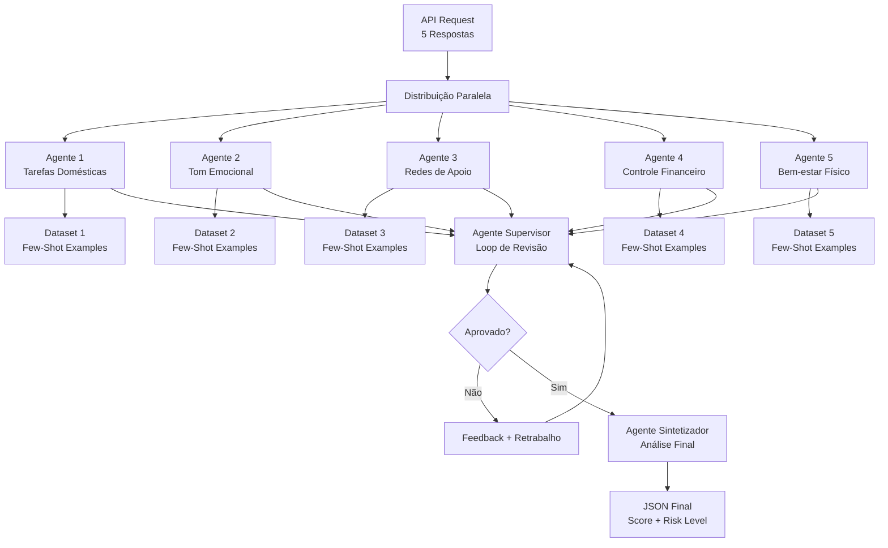
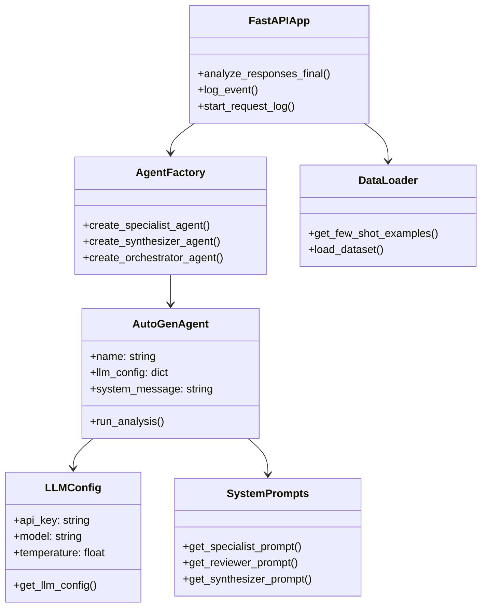
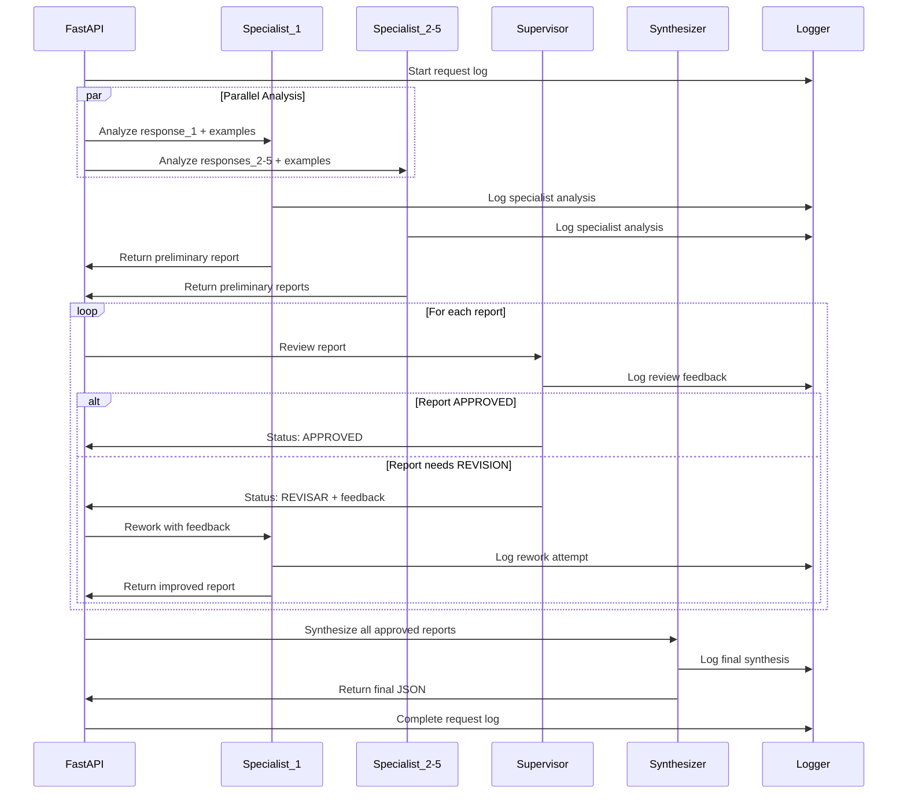

# 📊 RESUMO EXPLICATIVO: Sistema de Análise de Risco com IA Multiagente

## 🎯 Visão Geral do Sistema

Este projeto implementa um **Sistema Multiagente** avançado para análise de risco de violência doméstica, utilizando técnicas modernas de IA e o framework **AutoGen** da Microsoft. O sistema combina múltiplas especialidades de IA para fornecer análises precisas, auditáveis e responsáveis.

---

## 🧠 Conceitos de IA e Tecnologias Utilizadas

### 1. **Sistema Multiagente (MAS - Multi-Agent System)**
- **Conceito**: Em vez de um único modelo de IA monolítico, utiliza uma **equipe de agentes especializados**
- **Vantagem**: Cada agente tem expertise específica, simulando uma equipe humana de analistas
- **Framework**: Microsoft AutoGen para orquestração de agentes

### 2. **Few-Shot Learning (Aprendizagem por Poucos Exemplos)**
- **Conceito**: Cada agente especialista aprende através de exemplos específicos do seu domínio
- **Implementação**: Datasets CSV com casos reais e sintéticos para cada especialidade
- **Vantagem**: Análises mais contextualizadas e consistentes

### 3. **Hierarchical Orchestration (Orquestração Hierárquica)**
- **Conceito**: Sistema de revisão por pares com supervisor
- **Implementação**: Agente Supervisor que pode aprovar ou solicitar retrabalho
- **Benefício**: Garantia de qualidade e refinamento das análises

### 4. **Prompt Engineering Avançado**
- **Técnica**: Prompts especializados para cada papel (Especialista, Revisor, Sintetizador)
- **JSON Schema Enforcement**: Força saídas estruturadas e consistentes
- **Temperature Control**: Baixa temperatura (0.2) para respostas determinísticas

---

## 🏗️ Arquitetura do Sistema



---

## 🔄 Fluxo de Execução Detalhado

### **Fase 1: Análise Paralela Especializada**
```
1. API recebe 5 respostas da usuária
2. Cada resposta é enviada simultaneamente para um agente especialista
3. Cada agente consulta seu dataset específico (Few-Shot Learning)
4. Geram relatórios JSON preliminares independentes
```

### **Fase 2: Loop de Revisão Sequencial**
```
Para cada relatório:
├── Agente Supervisor analisa
├── Se APROVADO → Passa para síntese
└── Se REVISAR → 
    ├── Envia feedback detalhado
    ├── Agente especialista refaz análise
    └── Máximo 1 retrabalho por agente
```

### **Fase 3: Síntese Final**
```
1. Agente Sintetizador recebe todos os relatórios aprovados
2. Analisa conexões entre fatores de risco
3. Calcula score final consolidado (0-100)
4. Define risk_level (Baixo/Médio/Alto)
5. Retorna JSON estruturado final
```

---

## 🎭 Papéis dos Agentes

### **🔬 Agentes Especialistas (5x)**
- **Responsabilidade**: Análise especializada de um domínio específico
- **Input**: Resposta da usuária + Few-shot examples do dataset
- **Output**: Relatório JSON com análise, score preliminar e fatores
- **Técnica de IA**: Few-Shot Learning com exemplos contextuais

**Domínios de Especialização:**
1. **Agente 1**: Rotina e Sobrecarga de Tarefas
2. **Agente 2**: Tom Emocional e Intimidação  
3. **Agente 3**: Redes de Apoio e Isolamento Social
4. **Agente 4**: Controle Financeiro e Dependência
5. **Agente 5**: Bem-estar Físico e Psicológico

### **👨‍💼 Agente Supervisor**
- **Responsabilidade**: Controle de qualidade das análises
- **Técnica**: Análise crítica e feedback construtivo
- **Output**: APROVADO ou REVISAR + feedback
- **Papel**: Garantir consistência e profundidade das análises

### **🎯 Agente Sintetizador**
- **Responsabilidade**: Consolidação final dos relatórios
- **Técnica**: Análise holística e identificação de padrões conectados
- **Output**: Score final + Risk Level + Fatores consolidados
- **Papel**: Visão sistêmica dos riscos identificados

### **🎮 Agente Orquestrador**
- **Responsabilidade**: Coordenação técnica do fluxo
- **Tipo**: UserProxyAgent (AutoGen)
- **Função**: Inicia conversas e extrai respostas dos agentes
- **Configuração**: `max_consecutive_auto_reply=0` para controle preciso

---

## 🗂️ Estrutura de Dados e Conhecimento

### **Datasets Few-Shot (CSV)**
```
dataset_1.csv → Agente 1 (Tarefas Domésticas)
├── frase: Exemplo de resposta da usuária
├── risco: Classificação (Baixo/Médio/Alto)
├── fator: Fator de risco identificado
├── taxonomia: Classificação técnica
└── metadata: Dados complementares

Exemplo:
"A gente divide as contas de casa, mas a limpeza 
pesada sempre sobra pra mim.";Baixo;Desequilíbrio Leve
```

### **Sistema de Logging Auditável**
```json
{
  "request_timestamp": "2025-07-24T02:17:45.123456",
  "request_payload": {...},
  "events": [
    {
      "timestamp": "...",
      "type": "specialist_analysis",
      "agent_id": "1",
      "attempt": 1,
      "output": {...}
    },
    {
      "type": "reviewer_feedback",
      "status": "APROVADO"
    },
    {
      "type": "final_synthesis",
      "output": {...}
    }
  ]
}
```

---

## ⚙️ Tecnologias e Ferramentas

### **Framework de IA**
- **AutoGen**: Framework da Microsoft para sistemas multiagente
- **LLM**: Llama3-8b-8192 via Groq API
- **Temperature**: 0.2 (baixa variabilidade para consistência)
- **Response Format**: JSON object enforcement

### **Backend e API**
- **FastAPI**: Framework web assíncrono para Python
- **Pydantic**: Validação de dados e serialização
- **AsyncIO**: Processamento paralelo dos agentes

### **Processamento de Dados**
- **Pandas**: Manipulação dos datasets CSV
- **Random Sampling**: Seleção aleatória de exemplos few-shot
- **JSON**: Formato padrão para comunicação entre agentes

### **Infraestrutura**
- **Logging**: Sistema completo de auditoria
- **Error Handling**: Tratamento robusto de falhas
- **Rate Limiting**: Controle de chamadas para APIs externas

---

## 🎯 Técnicas de IA Específicas Implementadas

### **1. Chain of Thought Prompting**
```python
# Exemplo de prompt estruturado para raciocínio passo-a-passo
"""
1. Analise o RELATO ATUAL
2. Compare com os EXEMPLOS DE CASOS ANTERIORES  
3. Identifique fatores de risco específicos
4. Justifique seu score preliminar
5. Retorne JSON estruturado
"""
```

### **2. Self-Correction Loop**
```python
# Loop de auto-correção implementado
for attempt in range(MAX_REWORK_ATTEMPTS + 1):
    if feedback.status == "APROVADO":
        break
    else:
        # Agente refaz análise com feedback do supervisor
        current_report = await run_rework_analysis(feedback)
```

### **3. Ensemble Decision Making**
```python
# Decisão final baseada em múltiplas especialidades
final_score = consolidate_scores([
    specialist_1_score,
    specialist_2_score, 
    specialist_3_score,
    specialist_4_score,
    specialist_5_score
])
```

### **4. Context-Aware Analysis**
```python
# Cada agente tem contexto específico via few-shot
examples = get_few_shot_examples(agent_id)
task = f"RELATO ATUAL:\n{user_response}\n\n{examples}"
```

---

## 📊 Diagrama de Classes UML



---

## 🔄 Diagrama de Sequência



---

## 🛡️ Características de IA Responsável

### **1. Explicabilidade**
- Cada decisão é documentada com justificativa
- Logs completos de todo o processo de reasoning
- Fatores de risco específicos identificados

### **2. Auditabilidade** 
- Histórico completo de cada análise salvo
- Rastreabilidade de mudanças entre versões
- Timestamps precisos para cada etapa

### **3. Controle de Viés**
- Datasets balanceados com exemplos de baixo/médio/alto risco
- Multiple agents reduzem viés individual
- Sistema de revisão por pares

### **4. Robustez**
- Error handling em todas as etapas
- Fallbacks para casos de falha
- Rate limiting para APIs externas

### **5. Calibragem Contínua**
- Datasets facilmente atualizáveis
- Prompts modularizados para refinamento
- Métricas de performance trackáveis

---

## 🎯 Pontos Fortes da Arquitetura

### **1. Modularidade**
- Cada componente tem responsabilidade única
- Fácil manutenção e evolução
- Substituição independente de agentes

### **2. Escalabilidade**
- Processamento paralelo de análises
- AsyncIO para alta performance
- Arquitetura stateless

### **3. Qualidade**
- Loop de revisão garante consistência
- Multiple perspectives reduzem erros
- Síntese final oferece visão holística

### **4. Transparência**
- Logging completo para auditoria
- Processo de decisão documentado
- Rastreabilidade end-to-end

---

## 📈 Métricas e Monitoramento

### **Métricas de Performance**
- Tempo de resposta por requisição
- Taxa de aprovação vs. retrabalho
- Distribuição de risk levels

### **Métricas de Qualidade**
- Consistência entre agentes especialistas
- Correlação entre score preliminar e final
- Precisão das classificações

### **Logs de Auditoria**
- Histórico completo de decisões
- Padrões de feedback mais comuns
- Evolução da performance ao longo do tempo

---

## 🔮 Considerações Futuras

### **Possíveis Melhorias**
1. **Fine-tuning**: Treinamento especializado dos modelos
2. **Active Learning**: Incorporação de feedback humano
3. **Multi-modal**: Análise de áudio/vídeo além de texto
4. **Real-time**: Streaming de análises em tempo real

### **Escalabilidade**
1. **Distributed Computing**: Kubernetes para múltiplas instâncias
2. **Database Integration**: Armazenamento persistente de histórico
3. **Batch Processing**: Análise de múltiplas requisições
4. **API Gateway**: Load balancing e rate limiting avançado

---

Este sistema representa um exemplo prático de como técnicas modernas de IA podem ser combinadas para criar soluções responsáveis, auditáveis e eficazes para problemas sociais complexos.
